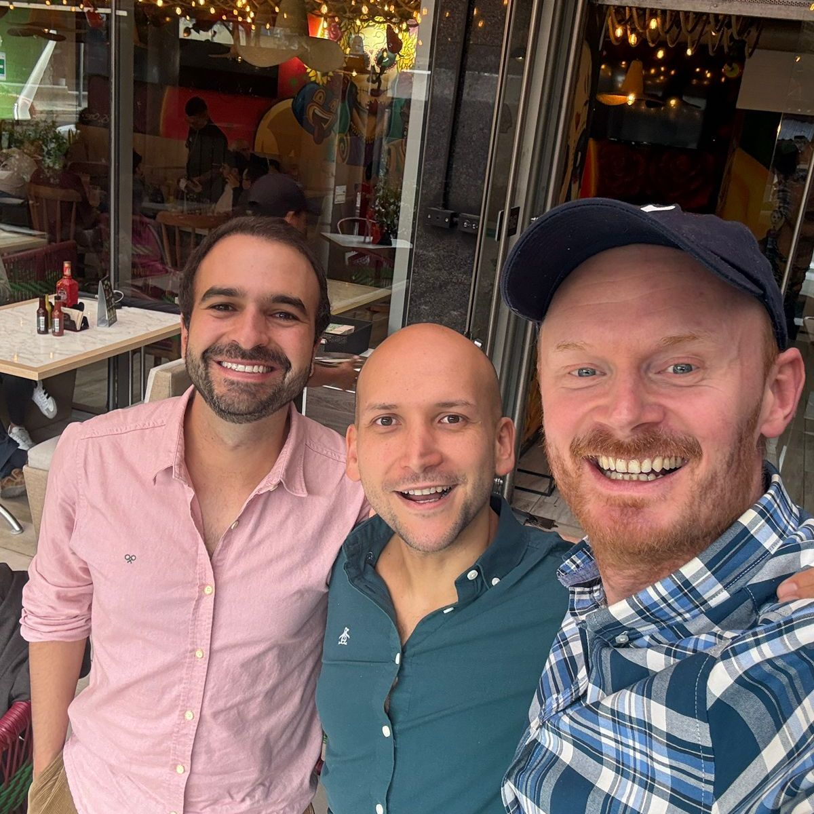

> *Originally posted on [LinkedIn](https://www.linkedin.com/posts/smuriel_co-construir-con-gigantes-como-henry-may-activity-7434698779615768576-PCay)*

Co-building with giants — like [Henry May](https://linkedin.com/in/henry-may). The education entrepreneur I admire most in the whole country.

Lunch with Henry is never boring. How are the kids, how's the company going... and then an hour of dreaming up the future together.

And if you're lucky, you get some Argentine accent impressions thrown in 😅

I wouldn't change a thing about the recipe. Great lunch, big dreams. Soon — very soon, finally — we'll be building things together.

