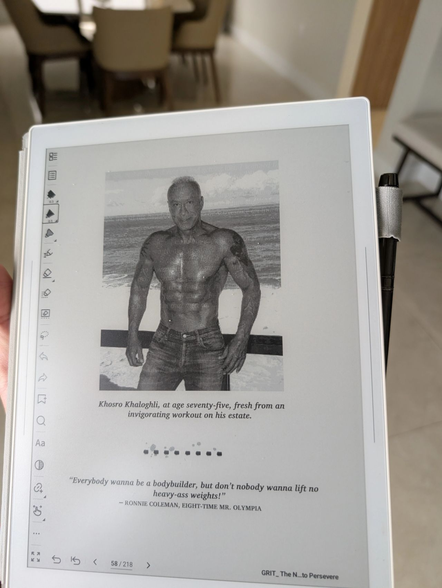
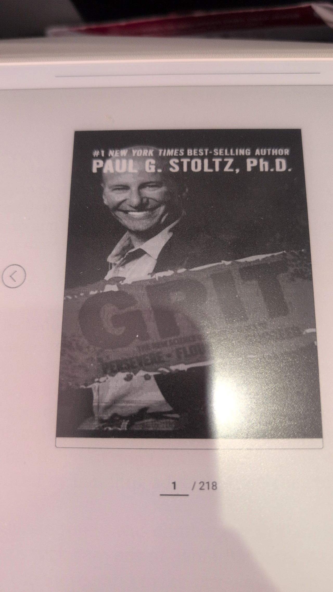

> *Originally posted on [LinkedIn](https://www.linkedin.com/posts/smuriel_me-estoy-terminando-grit-y-contrario-activity-7444408811576119296-_mpa)*

I was finishing "Grit"... and contrary to everyone I'd talked to, I found it pretty bad...

The whole book is basically the author trying to sell his consulting methodology 🫠

The guy turns everything into a trademarked acronym. GRIT™️, PLAY™️, WHY-TRY™️... such a drag.

And an extreme obsession with some "KK," a mega-ultra-billionaire American (who, I'll admit, does have a very inspiring life story). Although the shirtless photo of the guy was totally unnecessary 🩲.

Near the end, I start talking it through with my wife...

And I had read the wrong book 🙈 The one I wanted to read was by [Angela Duckworth](https://linkedin.com/in/angeladuckworth). Being careless/distracted/in a rush, I picked up a different one with the same title.

Mental reminder: always apply the carpenter's rule — check everything twice before swinging the hammer.

