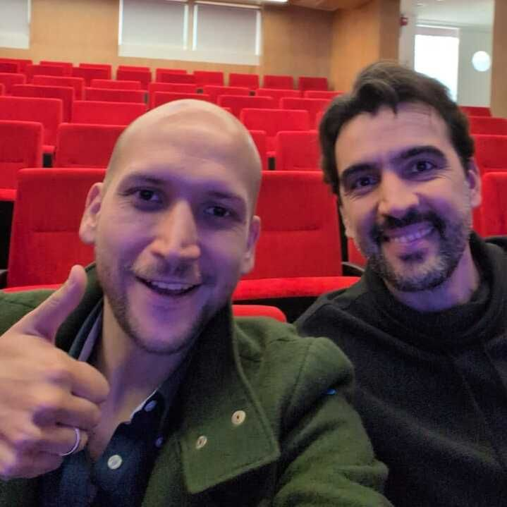

> *Originally posted on [LinkedIn](https://www.linkedin.com/posts/smuriel_la-semana-pasada-tuve-la-fortuna-de-estar-activity-7307532773588652032-X1yz)*

La semana pasada tuve la fortuna de estar varios días con [German Doin Campos](https://linkedin.com/in/germandoin), enfrentando los aprendizajes (mínimos en comparación) de las ~90 conversaciones que he tenido en los últimos meses con sus más de 15 años de experiencia creando propuestas educativas innovadoras.

Conversaciones extremadamente inspiradoras, conociendo su recorrido desde el lanzamiento de "La Educación Prohibida", fundar "Proyecto C" en Buenos Aires, asesorar decenas de colegios e iniciativas en educación. Insights sobre el rol de la educación superior, los retos en los proyectos con diversidad, la manera de desarrollar al tiempo sentir ❤️ + pensar 🧠 + hacer 🛠️...

También compartimos espacios con más líderes y actores en educación, ahondando en que es en realidad necesario para el sistema educativo actual. ¡Gracias al [Gimnasio Moderno](https://www.linkedin.com/school/gimnasio-moderno/) por prestarnos un espacio de reflexión y discusión!

En fin, ¡increíble! Cada vez más cerca de crear en grande en Educación, de la mano de personas como Germán 🇦🇷

