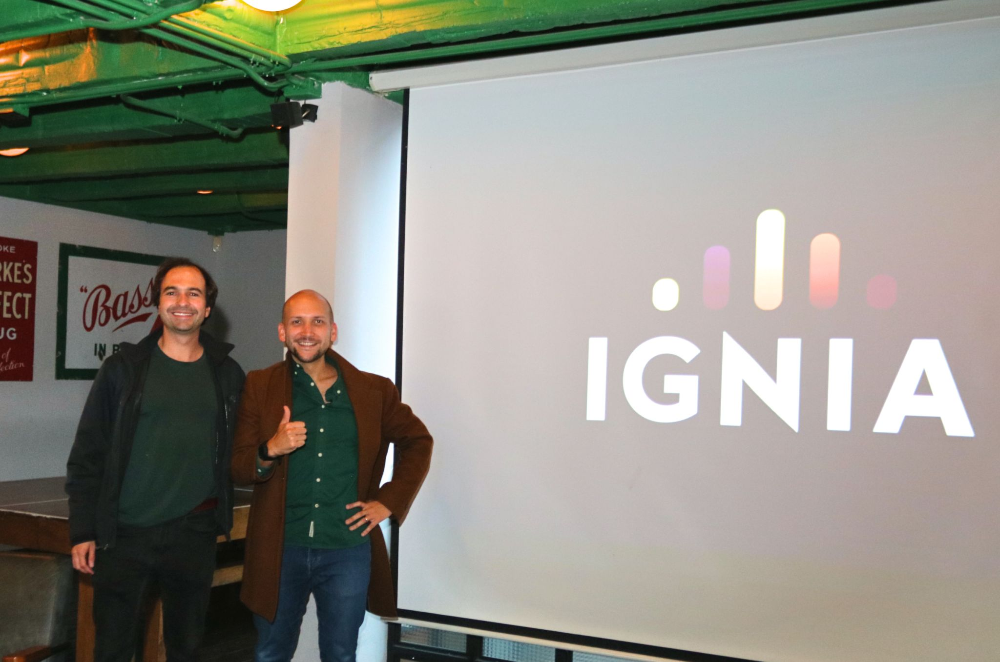

> *Originally posted on [LinkedIn](https://www.linkedin.com/posts/smuriel_nunca-subcontrates-el-alma-de-tus-proyectos-activity-7341157007640391680-S0ZQ)*

Nunca subcontrates el alma de tus proyectos 💀

Con mi primera empresa, El Palomo 🕊️, el core eran las flores, no la tecnología, así que subcontratar tech no fue grave (aunque igual quebré por novato 🙈).

Pero en PrestaGente y Beriblock, donde la tecnología SÍ era el core, subcontratar fue un error gigante. En PrestaGente, perdimos clientes white-label por la lentitud del desarrollo externo. En Beriblock, un equipo "experto" en Europa del Este nos generó demoras y sobrecostos que nos llevaron a la quiebra ❌.

La lección la aprendí: en Finco, [Oscar Corredor](https://linkedin.com/in/oscarcorredor) y yo desarrollamos todo desde cero. Con equipo propio, sacamos un MVP en 2 meses y en un año ya hacíamos 100K avalúos. Nuestra tech interna fue el principal asset por el que nos compraron al tercer año 💸.

En [R5](https://www.linkedin.com/company/grupor5/), toda la tecnología era nuestra. Con millones de usuarios, si algo se rompía hoy, lo arreglabamos hoy porque tenemos el control. Por eso es la mejor Insurtech de Colombia ❤️.

Ahora en [Ignia](https://www.linkedin.com/company/igniaeducation/), el core es Educación y Tech. Por eso, [Camilo Bonilla](https://linkedin.com/in/camilobonilla) y yo estamos construyendo todo. Estoy seguro de que así correremos cien veces más rápido 🏃‍♂️.

