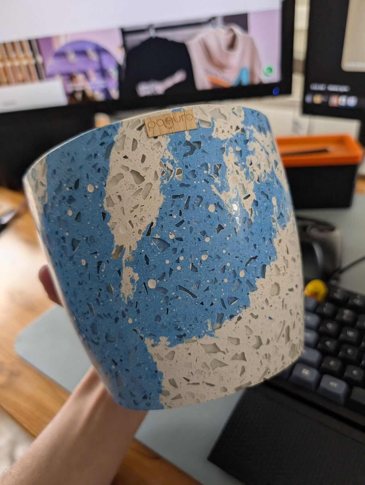

> *Originally posted on [LinkedIn](https://www.linkedin.com/posts/smuriel_dejemos-de-pensar-en-teor%C3%ADa-como-primer-paso-activity-7343319519190261760-VHjf)*

Dejemos de pensar en teoría como primer paso. Apliquemos el aprendizaje con práctica.

El finde estuve en Vassar (thx [Andrés Méndez](https://linkedin.com/in/andresfmendez) por sumarnos con [Ignia](https://www.linkedin.com/company/igniaeducation/) 🔥).

Conversamos con cientos de emprendimientos, y una cosa fue clara: para competir hay que innovar. Y para innovar toca experimentar en calle, experiencia real.

Ejemplo: Vimos a [Juan Sebastián Benítez Bustamante](https://linkedin.com/in/juansebastianbenitezb) con [Paguro](https://www.linkedin.com/company/paguroestudio/) - Convirtiendo desechos de construcción en decoración, muebles y arte (va fotico de mi matera 💙). Para lograr el producto final la teoría no alcanzaba: tocó experimentar cientos de "recetas", técnicas y mezclas diferentes.

Otro: [Sara Peña Marulanda](https://linkedin.com/in/sara-peña-marulanda-586453258) con [Un Poco Loco](https://unpocoloco.com.co/) - Stickers chéveres basados en cultura popular ⭐. Una locura, la gente se los llevaba a baldados. Sara empezó su emprendimiento a los 16 años, antes de empezar la U. En sus palabras... "Aprendo más aquí en una feria que en un semestre de U".

¿Que tal si las experiencias de aprendizaje nos llevaran a vivir procesos como los de Juan Sebastián o Sara? ¿Muy loco?

