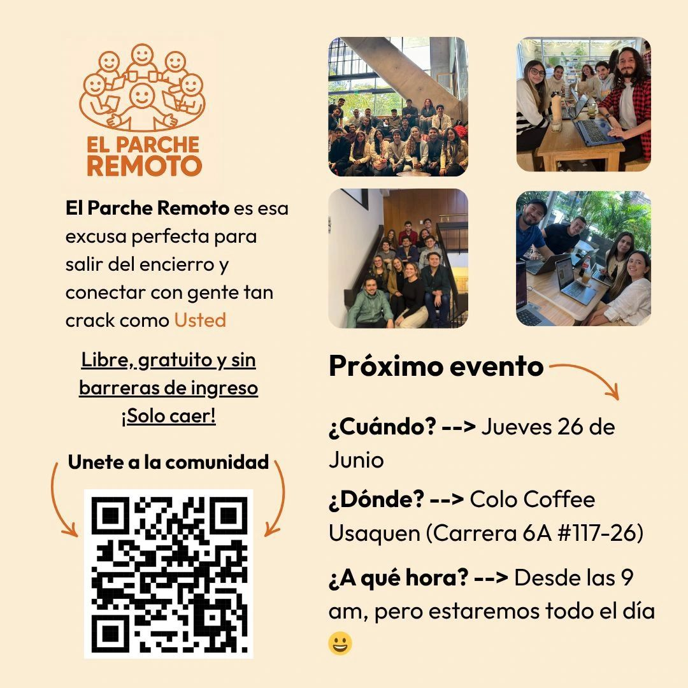

> *Originally posted on [LinkedIn](https://www.linkedin.com/posts/smuriel_quien-est%C3%A9-teletrabajando-y-ya-est%C3%A9-cansado-activity-7343639004405264385-FGSu)*

Quien esté teletrabajando y ya esté cansado del encierro 🫠, ¡venga al Parche Remoto!

Nos juntamos al menos una vez a la semana para coworkear juntos, conocer gente nueva y hacer buen parche en lugares chéveres 🕶️

Gratis y libre entrada. Solo caer. Y hasta nos dan descuento en el café por ser tantos jejeje somos +700 en Colombia.

▶️ Mañana en Bogotá nos vemos en Colo Café de Usaquén desde las 9am (pero se puede llegar en cualquier momento del día) ◀️ Pueden confirmar aquí: [https://lu.ma/m3gq6z55](https://lu.ma/m3gq6z55)

Si quieren ver dónde es el parche en tu ciudad, pueden entrar acá: [https://lnkd.in/edJVE-Cc](https://lnkd.in/edJVE-Cc)

[David](https://linkedin.com/in/davidtrianaagudelo), [Camilo](https://linkedin.com/in/camilo-navarro), [Lina](https://linkedin.com/in/lina-samper-santamaría-2b6832144), [Lina](https://linkedin.com/in/soylinasarmiento), [Nicolás](https://linkedin.com/in/nicolasvaronrodriguez) - ¿caen?

