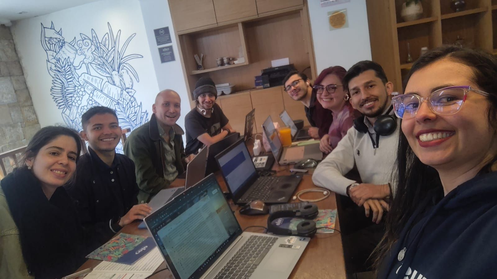
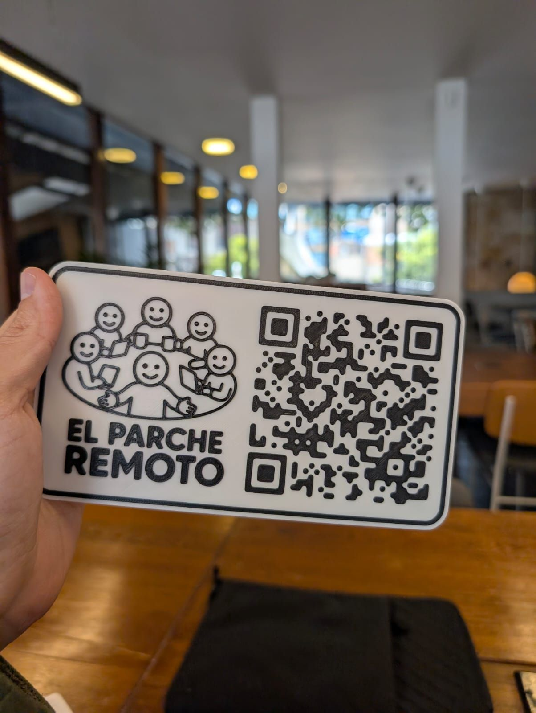

> *Originally posted on [LinkedIn](https://www.linkedin.com/posts/smuriel_hoy-con-el-parche-remoto-en-colo-coffee-roasters-activity-7344057570602471425-XgJO)*

Hoy con [El Parche Remoto](https://www.linkedin.com/company/parche-remoto/) en [Colo Coffee Roasters](https://www.linkedin.com/company/colo-coffee-roasters/) de Usaquén. Que chévere hacer comunidad ❤️

Gran mix! Psicología, Desarrolladores, PMs, emprendedores... pero más allá: Papás/mamás, cantantes, actores ([Sebastian Martinez Hoyos](https://linkedin.com/in/sebasmartinezhoyos) 🕶️ ), gamers, deportistas y más.

Conectar cara a cara es invaluable... para conocer otras personas interesantes, para aprender, para abrir la mente y salir del eco de los algoritmos.

Estamos todos los jueves (como mínimo!). Si quieren ver donde es el siguiente parche, en su ciudad o en otro lugar de Colombia, pueden entrar acá: [https://lnkd.in/edJVE-Cc](https://lnkd.in/edJVE-Cc)

