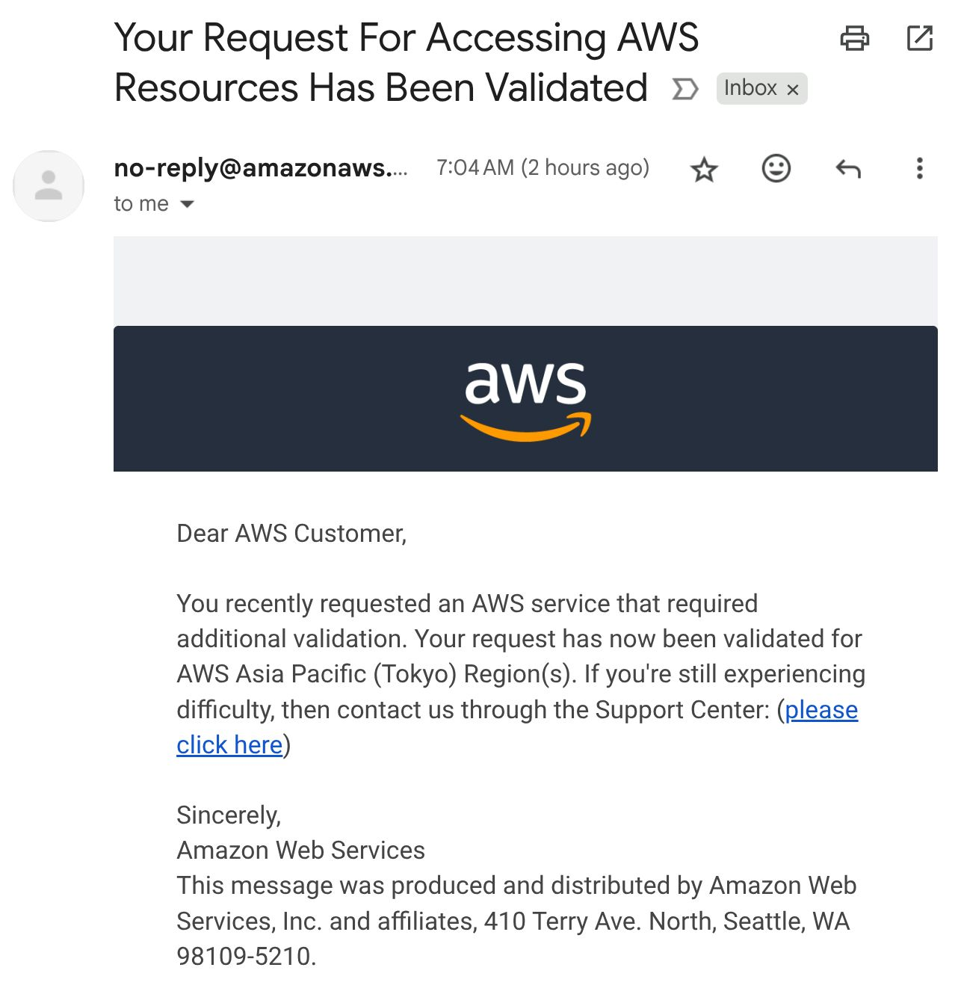

> *Originally posted on [LinkedIn](https://www.linkedin.com/posts/smuriel_hoy-me-lleg%C3%B3-el-correo-m%C3%A1s-temido-en-tech-activity-7344372797005082624-gkDO)*

Hoy me llegó el correo más temido en tech ☠️

No uso AWS con mi cuenta personal hace más de 2 años. Y al parecer estaba abriendo recursos en Tokio.

Entró y ahora mi cuenta tiene 2FA con un dispositivo que no controlo.

MENOS MAL las tarjetas que tenía en AWS ya las cambié todas hace un rato, o alguien ya habría minado cripto y yo tendría una deuda de algunos miles de dólares.

¿Que pasó? Pues lo obvio: Tenía una clave insegura 🙈 . Uso 1Password para mis claves desde hace año y pico, y pensé que ya había cambiado todas mis claves inseguras... pero no. Y con el hack de 1.6 mil millones de claves salió la mía vieja. PD, pueden ver si las suyas han salido acá: [https://lnkd.in/eUXJ6iC2](https://lnkd.in/eUXJ6iC2)

Lo bueno? Ya recuperé acceso y todo bien. Pero que susto tan HP 🫣

