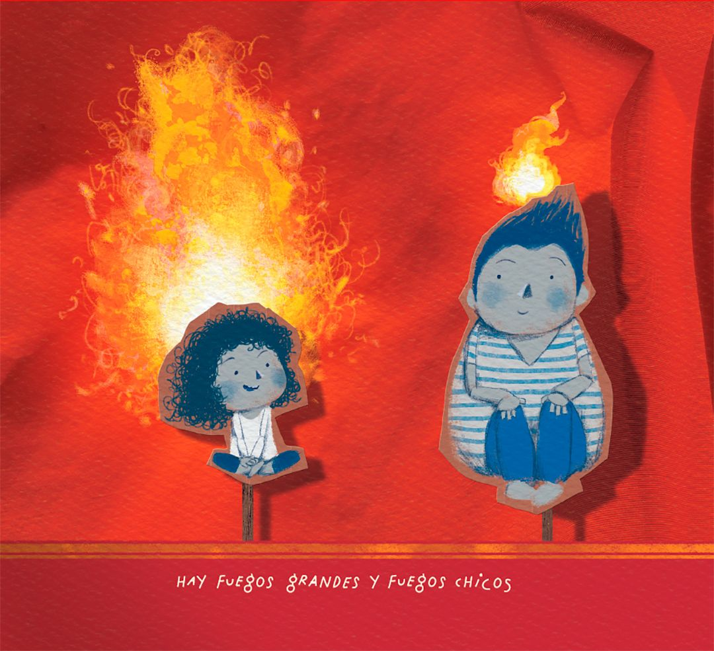

> *Originally posted on [LinkedIn](https://www.linkedin.com/posts/smuriel_que-machera-las-personas-con-%C3%ADmpetu-creador-activity-7348463144937111552-FGaT)*

Que machera las personas con ímpetu creador y fuego interno.

Eduardo Galeano escribió "Un Mar de Fueguitos". Como bien dice:

> "Algunos fuegos (...) no alumbran ni queman;
> pero otros, otros arden la vida con tantas ganas
> que no se puede mirarlos sin parpadear,
> y quien se acerca, se enciende"

El mundo necesita "gente de fuego loco que llena el aire de chispas". Creadores con ganas de hacer realidad sus ideas.

El Action Lab de [Ignia](https://www.linkedin.com/company/igniaeducation/) quiere juntar un grupo de fuegos intensos. Y que esos fuegos crezcan y brillen.

Uds, ¿qué tipo de fuego son?

