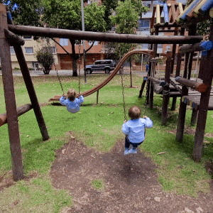

> *Originally posted on [LinkedIn](https://www.linkedin.com/posts/smuriel_emprender-es-una-decisi%C3%B3n-de-completa-entrega-activity-7351297172971102209-g38l)*

Emprender es una decisión de completa entrega... no queda tiempo para nada más. Va por encima de familia, amigos, salud. ¡FOCO!

⬆️ Pura Mier... 💩

Come tiempo, sí. Igual que cualquier trabajo.

La cabeza no deja de pensar en eso, sí. Igual que cualquier cosa apasionante.

Hay que trasnochar a veces, sí. Igual que cualquier cosa que vale la pena.

Pero se puede con balance. Yo llevo emprendiendo 10+ años y de alguna manera saco tiempo para:

🐥🐥 Mellizos (hablando de proyectos que requieren tiempo 👀 )
💛 Vida familiar sana (Esposa, veo a mis papás y abuelos, primos, etc)
🏃 Ejercicio (Esto fue lo que MÁS me costó pero este año lo logré! Primera Media Maratón en 10 días)
🙆‍♀️ Amigos (Con alguien almuerzo todas las semanas, findes de vez en cuando)

El secreto es solo ser eficiente. Trabajar juicioso, enfocado y MEGA productivo de 8 a 5-6 para poder estar con los chiquis y la familia. Juntar espacios (ejercicio junto con amigos, paseos con familia + amigos).

Cerrar el compu a las 6 con lo urgente e importante hecho... y aceptar que mañana se puede el resto.

A veces toca trasnochar, levantarse más temprano, trabajar findes: Sí. Pero también el emprender da flexibilidad y uno repone en otro espacio. Como una salidita al parque en una tarde de Lunes, por ejemplo.

