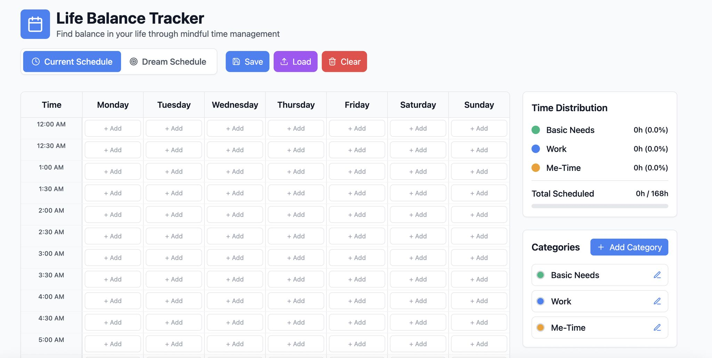

> *Originally posted on [LinkedIn](https://www.linkedin.com/posts/smuriel_hice-una-app-para-lograr-balance-al-tiempo-activity-7351714978141204480-46j-)*

Hice una app para lograr balance al tiempo que se es mega productivo ⬇️ Gratis!

Hoy estuve almorzando con un grupo de emprendedoras con fuego 🔥 - Combo Lauras de [Provi](https://www.linkedin.com/company/provi-investments/) ([Laura Cadena Sanchez](https://linkedin.com/in/laura-cadena-sanchez-84571682) + [Laura Camila Mejia Vargas](https://linkedin.com/in/laura-camila-mejia-vargas)), [Daniela Rojas](https://linkedin.com/in/daniela-rojas-osorio) de [Teia Invest](https://www.linkedin.com/company/teia-invest/) y [Carolina Franco 🦋🌊](https://linkedin.com/in/francocarolina) que está soñando un proyecto en Stealth Mode.

Conversamos acerca de balance (emprendiendo o no!) ¿Que tan seguido nos tomamos tiempo para nosotros? ¿Cuánto de "nuestro tiempo" lo botamos scrolleando 📱 ? ¿Si hacemos las cosas que nos mueven?

Un ejercicio fácil es organizar nuestro día y semana en bloques, y ver hoy en que gastamos vs mañana en que quisieramos gastar. Solo hay 168 horas en una semana!

Así, después de llenar el actual, solo tenemos que empezar a elegir que de verdad nos suma y queremos hacer mañana.

Estoy haciendo mentorías con un par de personas donde ya lo aplicamos y el cambio al enfrentarse con la decisión consciente de elegir es increíble. Sacar tiempo para hobbies (como bordar, videojuegos, cocinar) en vez de perderlo en Doomscrolling ☠️

Hice una app con [bolt.new](http://bolt.new) para sacarlo fácil. Como [Pedro Mejia](https://linkedin.com/in/pedromejiar) dice que sí se pueden dejar links en el post, acá va:

La App ▶️ [https://lnkd.in/e-g8hQbG](https://lnkd.in/e-g8hQbG)

