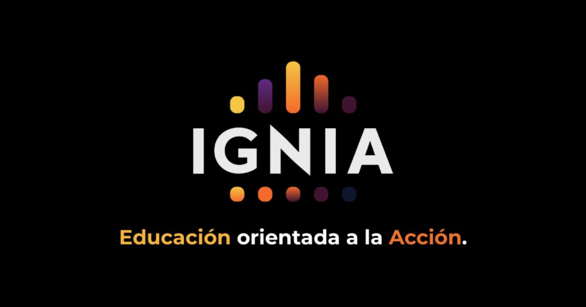

> *Originally posted on [LinkedIn](https://www.linkedin.com/posts/smuriel_ignia-educaci%C3%B3n-orientada-a-la-acci%C3%B3n-activity-7355992981394321408-3ws_)*

🎁 Regalo espacios de mentoría semanales a 3 personas con fuego 🔥

Sé lo difícil que es crear algo desde cero. ¿Cómo se empieza? ¿Qué pasa si me va mal? ¿Cómo se da el primer paso (o el segundo, o el tercero)?

Montar algo no es solo lo técnico: ¿cómo lo balanceo con mi vida e intereses? Si ya empecé, de repente se me va el balance vida/trabajo a la caneca y me quemo. ¿Cómo seguir?

Hace 3 años di mi primera mentoría real con [Nicolás Varón](https://linkedin.com/in/nicolasvaronrodriguez), y me encantó la experiencia. Hoy somos buenos amigos. Hace poco inicié con [Maria Fernanda Montejo Quiceno](https://linkedin.com/in/mariafernandamontejo) y ha sido increíble ver el cambio en tan solo 4 sesiones.

Entonces, quiero conocer nuevos mentees. Cero strings attached. No cobro NADA, ni la primera hora ni ninguna (escribanle a Nico o Mafe y les preguntan). Requisitos - Tener fuego🔥 por construir algo nuevo, llevar un proyecto que ya tengan al siguiente nivel o reinventarse profesionalmente. No importa la industria, tu expertise, tu edad o historia previa.

Para aplicar, solo estos dos pasos:
1️⃣ Comenta en este post "FUEGO"
2️⃣ Inscríbete y asiste a una charla informativa del Ignia Action Lab en [https://www.ignia.lat](https://www.ignia.lat)

Voy a elegir a los nuevos mentees el próx miércoles entre los que hayan ido a la charla de mañana 30 de Julio a la del 5 de Agosto.

Si sabes de alguna persona que tenga muchísimo PERRENQUE 🚀 y necesite ese acompañamiento para salir de la inercia y lanzar algo nuevo o crecer en su proyecto actual, taggeala aca o compartele la oportunidad.
Quiero conocerlx.

