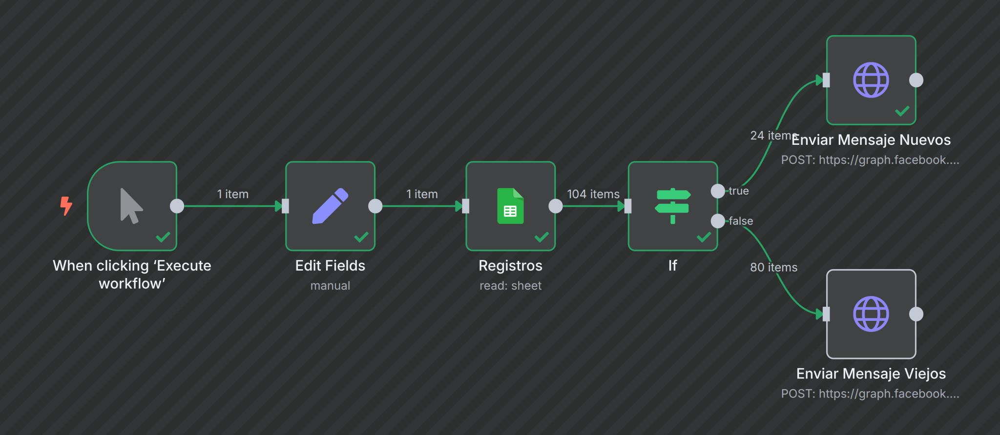
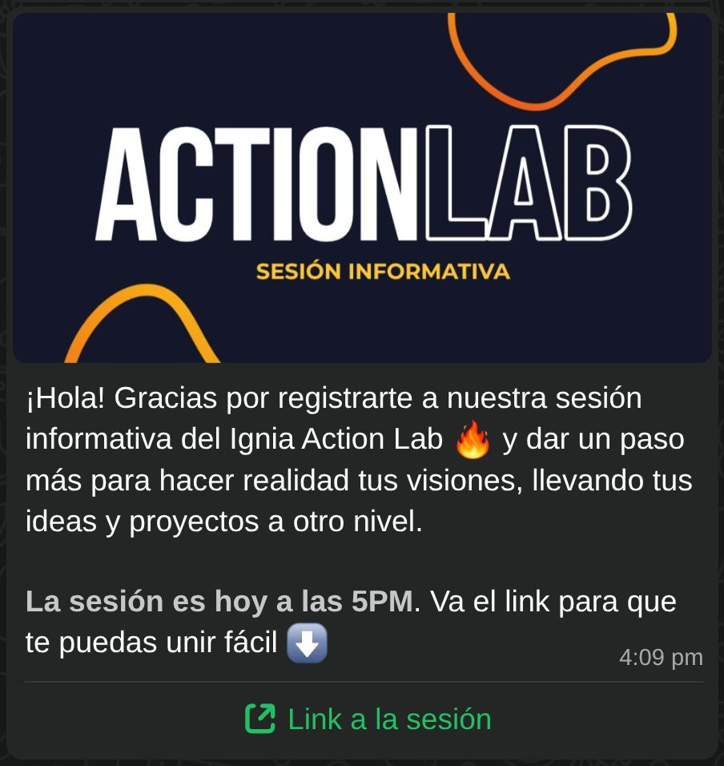

> *Originally posted on [LinkedIn](https://www.linkedin.com/posts/smuriel_no-hay-que-automatizar-todo-solo-cuando-activity-7358611588708278275-WCaf)*

No hay que automatizar todo... solo cuando hacer la versión 'chinomatic' se va a volver repetitivo. Cómo este flujo de WhatsApp que saque hoy 📲

No siempre hay que salir a automatizar todo (aunque la tentación es grande 😈 )

Si algo te va a tomar 15 mins, y te echas 2 horas automatizandolo, no te ahorraste tiempo. Aprendiste, pero ajá, el tiempo vale!

Si repites la actividad 4 veces, aún no vale la pena. Pero si ya va siendo algo constante, mensual, doloros, pa'lante.

En Ignia tenemos sesiones informativas cada semana. Al inicio teníamos 15 inscritos - mandeles recordatorio a mano. Luego 30... aún se logra.

Para la de hoy ya tocaba mandar 104 mensajes. ¡Mejor ya meterle mano!

Se me fueron unas 4 horas entre sacar todo lo de WhatsApp Business en línea (por cierto, creo que odio la API/DevEx de WhatsApp) y montar+probar la automatización, y me ahorre al menos 50 horas al año en mandar a mano. Una semana de trabajo para mis cosas 🍻

Y hasta más bonito/funcional queda que mandarlo a mano, con imágen y Link directo.

Si alguien quiere que le pase el flujo (lo arme en n8n) avíseme por interno o en los comments. ¿Qué otras cosas chéveres/cansonas han automatizado o quisieran automatizar? Les ayudo no problem 🙌

PD: Sí, sé que lo podía hacer más fácil con Twilio o Brevo. Pero ajá me quería ahorrar la plata (hasta self-hosteado tengo el n8n).

