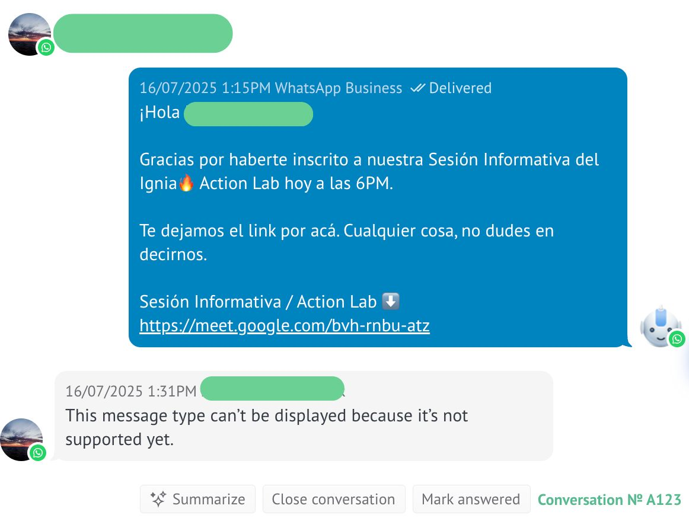
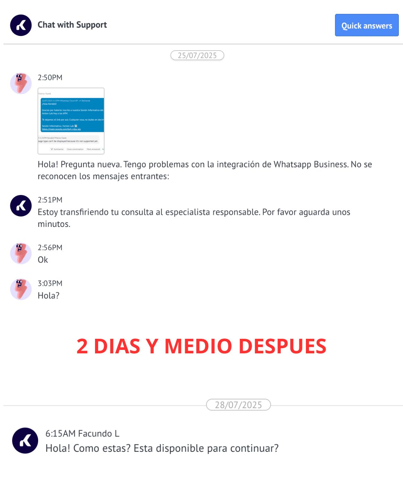

> *Originally posted on [LinkedIn](https://www.linkedin.com/posts/smuriel_la-cagu%C3%A9-escogiendo-crm-mis-lecciones-activity-7361076712631062528-Q2Nr)*

La cagué 💩 escogiendo CRM. Mis lecciones ⤵️ . PD, no usen Kommo.

Productos como el Action Lab de Ignia (B2C high-ticket) tienen un funnel de muchos leads, pocos cierres. Para no perder la pista, toca tener la vuelta organizada.

Los expertos me decían "mejor algo simple o conocido y luego ve si se cambia". Sheets o ClickUp o Hubspot y ya.

Peeeero me obsesioné (red flag 🚩 ) con un CRM que tuviera integración con WhatsApp + Instagram, que pudiera metersele de una AI, que no fuera tan caro, que fuera fácil de usar para todo el equipo, que esto y lo otro y lo otro.

No hice caso a los expertos (red flag 🚩 ). Después de mucho preguntar, por grupos de WhatsApp salió como 2 veces Kommo... Salieron 100 veces Hubspost y Pipedrive pero ajá, la cagué 🙈 .

Se veía ideal. Todo lo que quería. En la reu demo me encantó. De una pagué el contrato a 6 meses y a usarlo. RED FLAG GIGANTE 🚩🚩🚩 - No lo probé personalmente a fondo.

Pues, no funciona como lo venden :( La interfaz es vieja y lenta. Lo de AI es a medias. Se le pierden interacciones de Instagram. NO FUNCIONA LA INTEGRACIÓN DE WHATSAPP 😭 . El servicio al cliente es pésimo, se demoran horas o días en contestar.

Pedí devolución (ya veremos si llega). Y mas bien monté algo simple en ClickUp.

Peor de los red flags 🚩 : resulta que casi ningún lead nos escribe por WhatsApp e Instagram. 99% llegan directo a la página y nos dejan sus datos. Mi obsesión era de un assumption falso 🫠

Aprendizaje: KISS - Keep it simple, stupid. Y hacerle caso a los que saben más que uno.

Para cuando queramos crecer un poco más, ¿qué CRM recomiendan?

