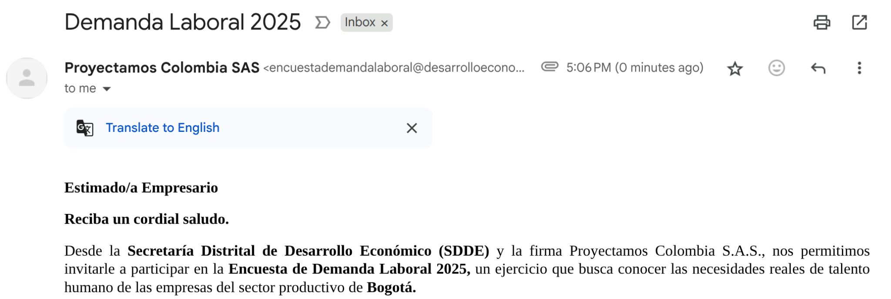

> *Originally posted on [LinkedIn](https://www.linkedin.com/posts/smuriel_me-lleg%C3%B3-el-correo-m%C3%A1s-asustador-del-mes-activity-7361519423863619584-dZL2)*

Me llegó el correo más asustador del mes ☠️  una Demanda Laboral.

NOT. Una invitación a una encuesta. Pero ala, quién haya escrito ese asunto no pensó en cómo lo iba a recibir el del otro lado.

Bueno, pero al menos logró el cometido de hacerme abrirlo y leerlo...

