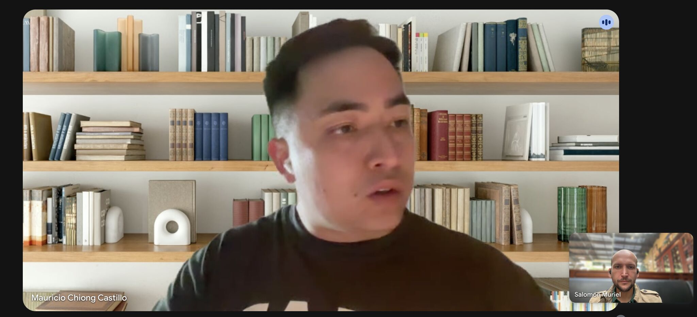

> *Originally posted on [LinkedIn](https://www.linkedin.com/posts/smuriel_hace-poco-cont%C3%A9-c%C3%B3mo-la-hab%C3%ADa-cagado-escogiendo-activity-7365872491593879552-oxYQ)*

Hace poco conté cómo la había cagado escogiendo CRM (sry los que botaron hate, Kommo de vd es muy malo 🙈). Y me llegó un mensaje interesante.

Lo más importante al inicio de un nuevo producto es estar pegadito a usuarios y el ecosistema. Toca vibrar con los dolores del mercado.

[Mauricio Chiong Castillo](https://linkedin.com/in/maurochiong) me escribió, no a vender (opuesto a al menos 15 mensajes de ventas de otros CRMs), sino a preguntarme exactamente que pasó.

Se está montando el próximo gran CRM enfocado en WhatsApp Marketing ([Eclectic AI, Inc](https://www.linkedin.com/company/eclectic-ai/)). Y no solo no me quizo sacar un peso - me dió valor y hasta una prueba gratis 100% sin ataduras. Solo quería saber mis dolores.

Le conté no solo lo que pasó con Kommo sino también la falta de soluciones para LinkedIn. A lo mejor pronto tenemos el próximo gran CRM para LinkedIn también 🚀

Y al menos la integración con WhatsApp funciona entonces ya le ganan a Kommo jejejeje

Al inicio, lo más importante es entender los dolores de quienes compran. Después ya viene vender (desde el valor, no de spammear msjs 🥴 ). Y toca tener cero miedo de mensajes en frio para entender el problema.

