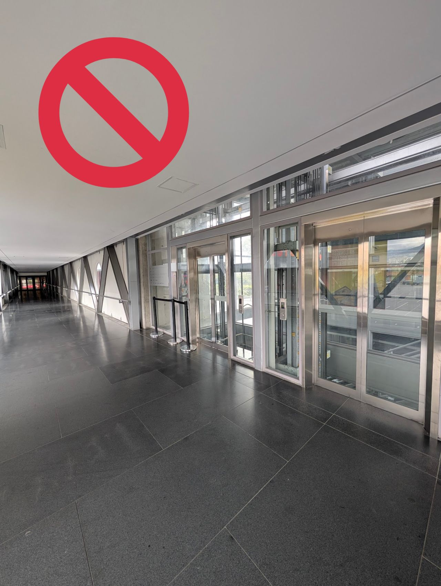

> *Originally posted on [LinkedIn](https://www.linkedin.com/posts/smuriel_hablando-de-dise%C3%B1o-con-sentido-y-luego-mal-activity-7367224780527128576-fHro)*

Hablando de diseño con sentido, y luego mal usado. Cómo panquecas es que construyen el Ágora (increíble proyecto), lo pegan a Corferias por un puente-tunel (que buena idea)... y no se puede usar? 😡

Fuí al GoFest Miércoles y Viernes (estaba súper). Ayer almuerzo con equipo de [Educación Estrella®](https://www.linkedin.com/company/educacion-estrella/) (mega inspirador, thx [Luis  Cedeño Hernández ](https://www.linkedin.com/in/luiscedeno1), [Wei-maa Hung](https://www.linkedin.com/in/wei-maa-hung), [Santiago Garcés Marulanda](https://www.linkedin.com/in/santiago-garces-m) por la conversa y el almuercito).

Está lloviendo. Hay un puente-tunel. Voy directo al parqueadero. El tunel TIENE ASCENSOR QUE VA AL PARQUEADERO. Paso el tunel, llego al ascensor, un señor (muy amablemente) me dice que no lo puedo usar. Y que no puedo usar ni el tunel, por favor devuélvase (y mojese pa pasar la calle).

Va foto del ascensor prohibido.

[Cámara de Comercio de Bogotá](https://www.linkedin.com/company/camaracomerbog/)
[Corferias, Centro internacional de Negocios y Exposiciones de Bogotá.](https://www.linkedin.com/company/corferias/)

