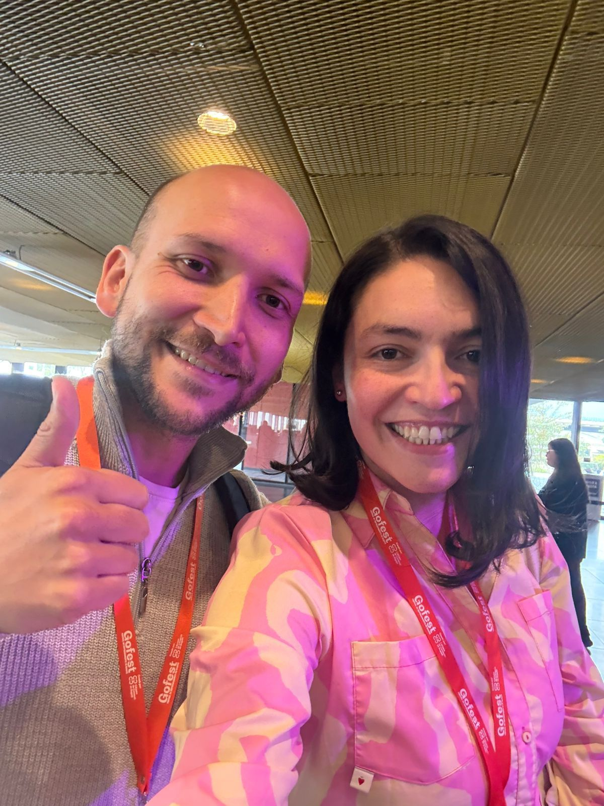
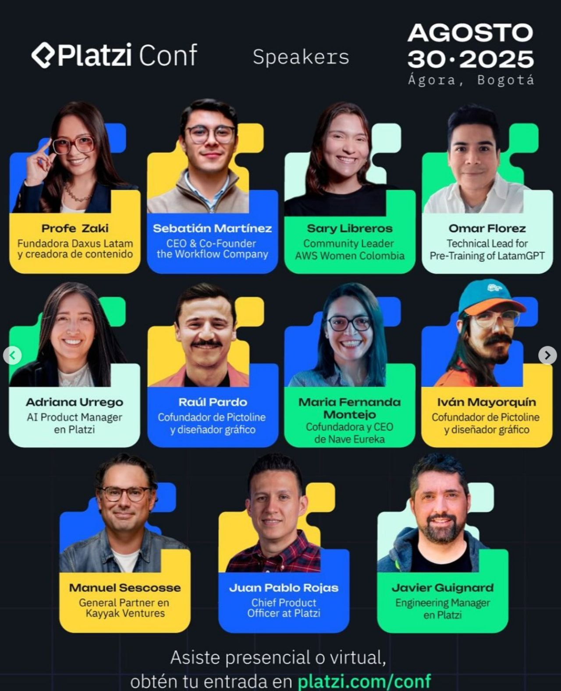

> *Originally posted on [LinkedIn](https://www.linkedin.com/posts/smuriel_gofest-platziconf-activity-7367560962746363904-OG35)*

¿Sabían que la palabra "trabajo" viene de la palabra para "torturar" ☠️?

[Maria Fernanda Montejo Quiceno](https://www.linkedin.com/in/mariafernandamontejo) me enseñó ayer en el #GoFest que la palabra "trabajo" viene del latín "tripalium" - que era un instrumento de tortura 🫠

Luego, averigüe anoche, se fue transformando hasta significar esfuerzo de cualquier tipo.

Llevamos literal milenios repitiendonos que hay que trabajar, trabajar, trabajar. ¿será hora de repetirnos algo diferente?

Creo -igual que Mafe- que debemos buscar emplearnos en labores en las que seamos buenos, nos sintamos llenos y seamos productivos.

Si no, puede que se sienta como tortura 🙈

Mafe va a hablar de esto HOY a las ~5:20PM en el #PlatziConf (crack 🧨). Mafe es fellow Ignia (no es casualidad, demasiado fuego 🔥).

▶️ Los invito a que le echen ojo a la charla de Mafe mañana. La va a totear. ◀️

Alguien tiene más consejos/tips/insights para "sentir" que el trabajo lo llena? El viejo "ikigai" existe?

PD: Quien quiera hablar con Mafe, los conecto. Se está montando un proyecto una LOCURA para convertir libros donados en becas de educación superior . Un proyecto rentable que sostiene una fundación y misión social, lo máximo.

