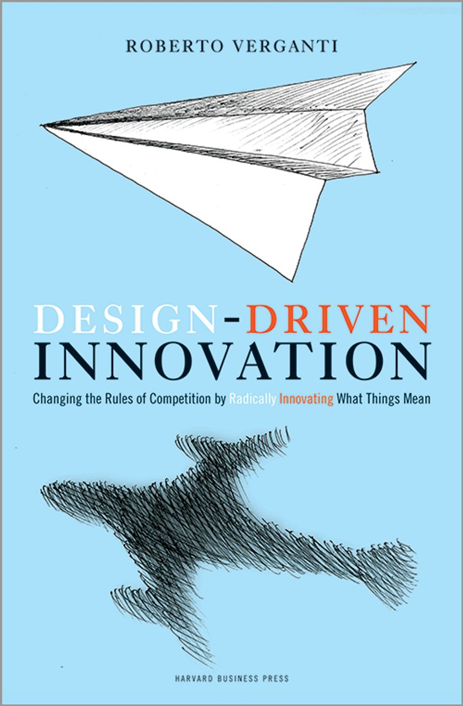
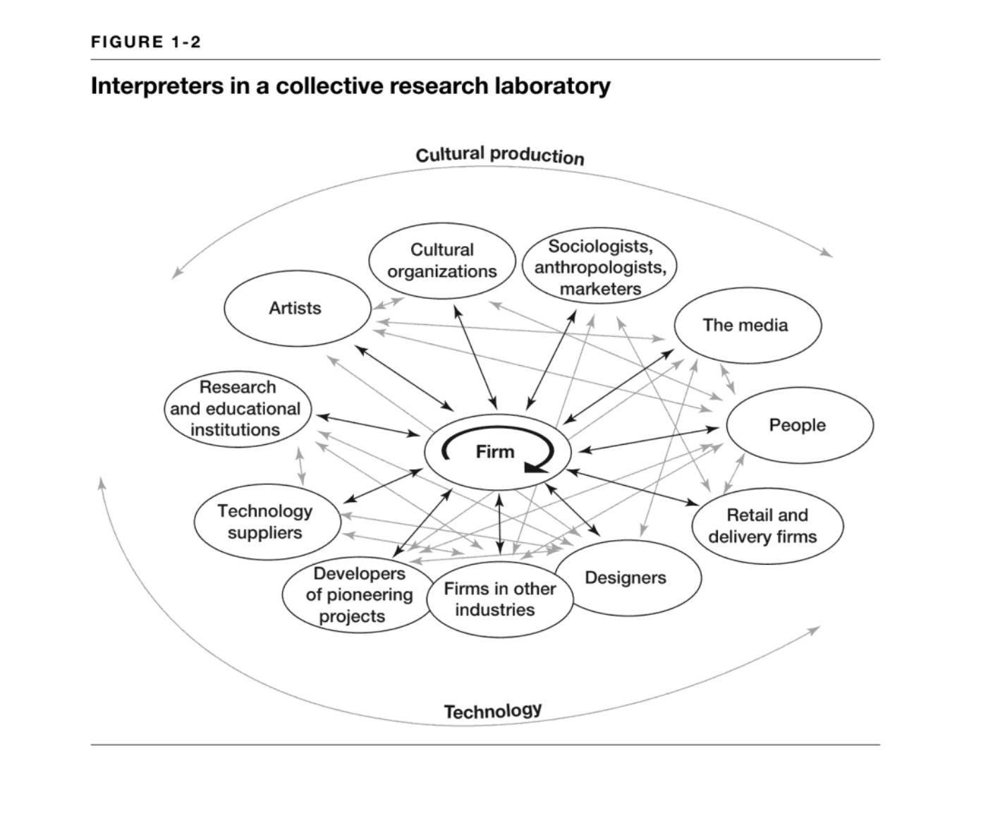
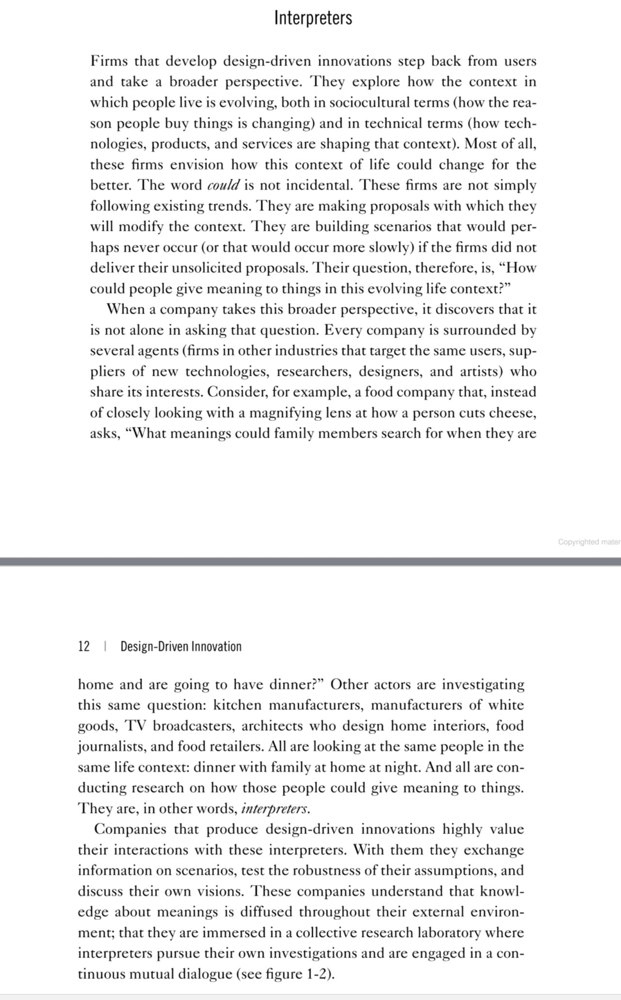
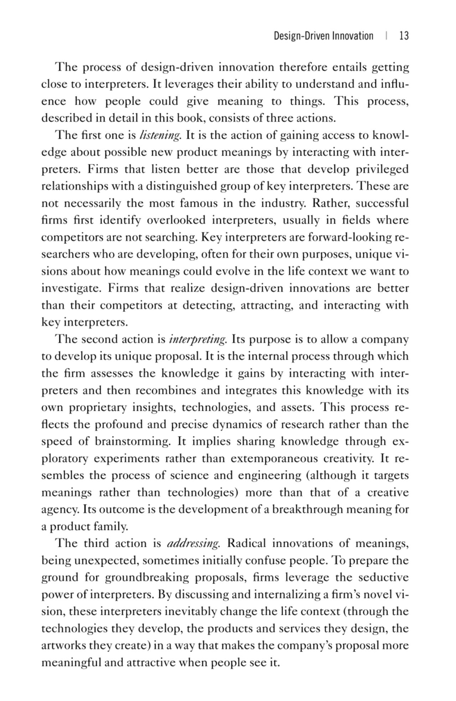

> *Originally posted on [LinkedIn](https://www.linkedin.com/posts/smuriel_dise%C3%B1o-centrado-en-el-usuario-pero-es-activity-7368308351073415168-a9QO)*

Diseño centrado en el usuario... pero es que a veces los usuarios hablan mucha 💩 (o no saben lo que necesiten realmente)

Para crear cualquier proyecto hay que tener feedback de usuario - sí. Pero no puede ser ley.

Mi esposa se está leyendo un libro buenísimo (Design Driven Innovation) que habla de cómo el diseño puede no partir de los usuarios directamente sino de "interpretes".

Un "interprete" es alguien que ya observa el problema y el usuario de manera activa. En educación por ejemplo podría ser un profesor, una rectora, un dueño de colegio (y un estudiante también), una emprendedora en EdTech.

Todos están viendo a los mismos problemas y usuarios desde diferentes lentes. Y sus insights sumados son mucho más valiosos que si se toma a los usuarios como ley.

Ejemplo trillado: Si uno le fuera a preguntar a un señor de 1890 cómo mejorar su modo de transporte, pediría un caballo más rápido 🐎 . Pero si uno fuera a hablar con industrialistas, científicos avanzando en motores de combustión y vapor, maquinistas... tal vez se le ocurre inventarse el carro 🚗 .

Siento que sin saberlo, eso hice hablando con mis ~107 expertos en educación. Ustedes... ¿En que casos creen que vale la pena y en cuales no? ¿Será que el usuario siempre tiene la razón?

