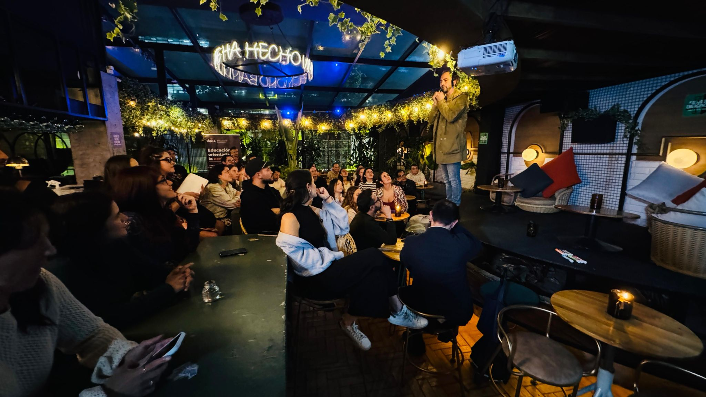
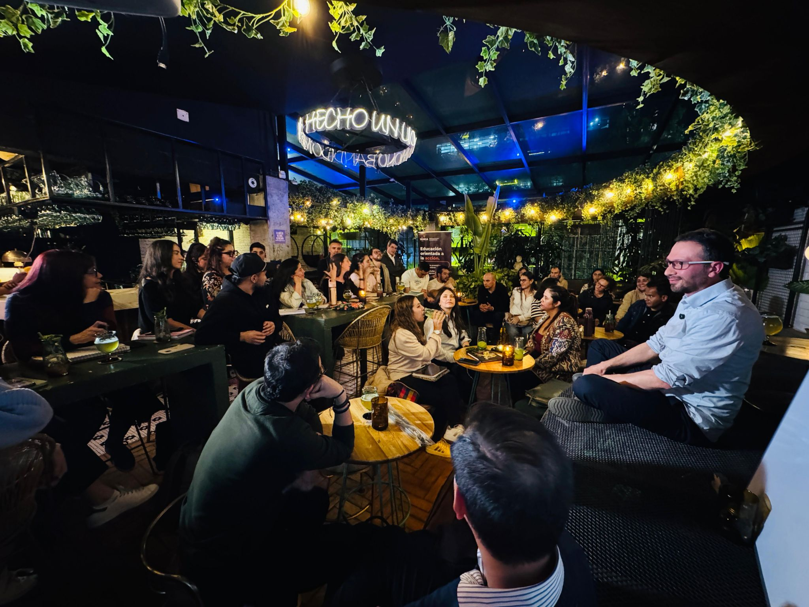
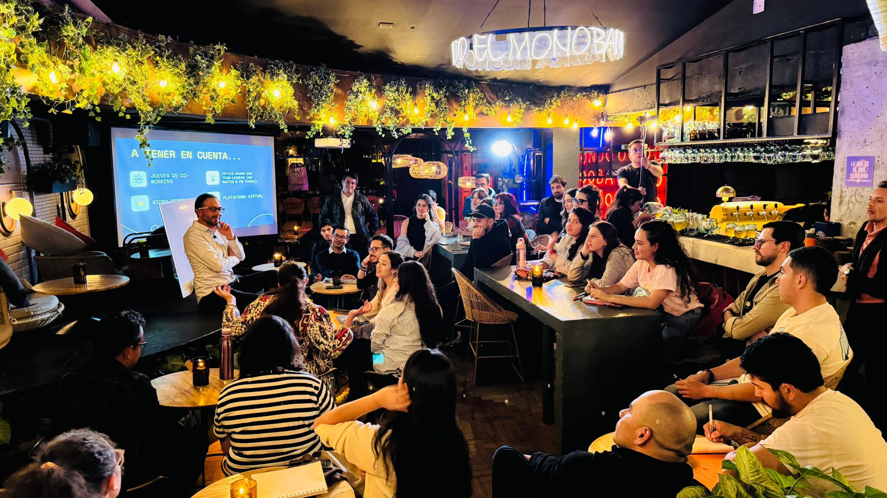
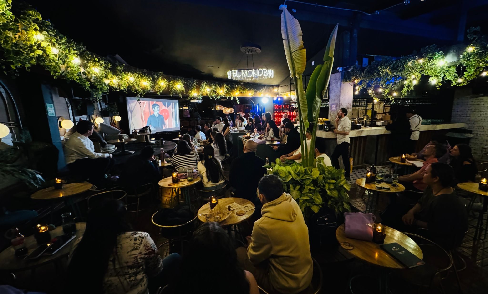

> *Originally posted on [LinkedIn](https://www.linkedin.com/posts/smuriel_me-dijeron-que-no-se-pod%C3%ADa-me-dijeron-activity-7369484245439909888-BvmW)*

Me dijeron que no se podía ❌

Me dijeron que no se podía crear un programa educativo en menos de 6 meses.

Me dijeron que conseguir profesores, espacios, planear el contenido, montar la plataforma y venderlo necesitaba un equipo de al menos 4 personas full time.

Me dijeron que no se podían vender ni 20 cupos de $1200 USD en 2 meses. Al menos 6 meses de ventas, MÍNIMO.

Me dijeron que no era vendible - que todos los usuarios buscan un certificado de calidad, que sin marca uno en educación no vende nada.

Ayer empezó el Action Lab. Llegamos a 33 personas con fuego 🔥   para la primera cohorte.

Sí se pudo 🚀 . Y se podrá más.

[Camilo Bonilla](https://www.linkedin.com/in/camilobonilla), yo, los profes y todos los que nos han apoyado (también hubo algunos locos que dijeron SÍ SE PUEDE) vamos con toda a reimaginarnos la educación superior. Sí se puede. ¿Quién se nos une?

