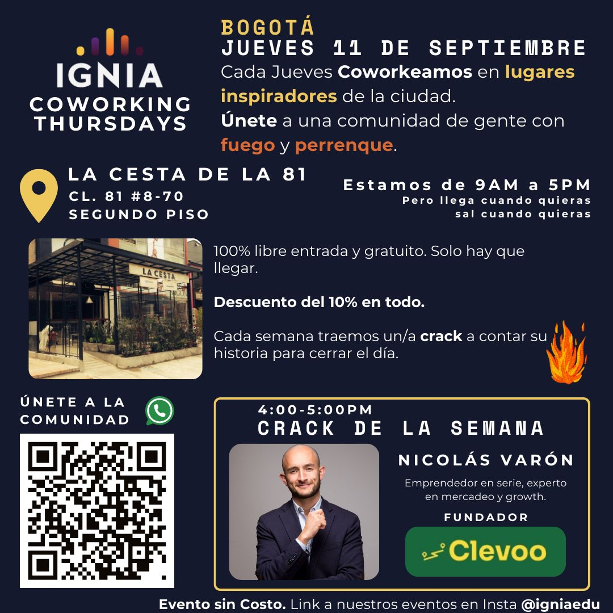

> *Originally posted on [LinkedIn](https://www.linkedin.com/posts/smuriel_este-jueves-y-todos-los-jueves-estamos-de-activity-7370950878394023936-yHzm)*

Este Jueves y todos los jueves estamos de Ignia Coworking Thursdays ⬇️

Nos juntamos para coworkear en lugares inspiradores de la ciudad para parchar, conectar con nuevas personas y crear 🚀

100% gratis y libre entrada y 10% de descuento en toda la carta del lugar 💸. RSVP: [https://luma.com/2it8rurj](https://luma.com/2it8rurj)

Somos una comunidad de personas con fuego🔥 como tu. Ya sea que trabajes como emprendedor, freelancer, en una startup, empresa o fundación. No importa tu edad o sector, solo el perrenque. ¡Te esperamos!

Invitado especial: [Nicolás Varón](https://www.linkedin.com/in/nicolasvaronrodriguez), emprendedor en serie, co-fundador de la [Asociación de Emprendedores](https://www.linkedin.com/company/asociaciondeemprendedores/), experto en marketing y growth, fundador de [Clevoo | Clever Growth](https://www.linkedin.com/company/clevoo-growth/).

