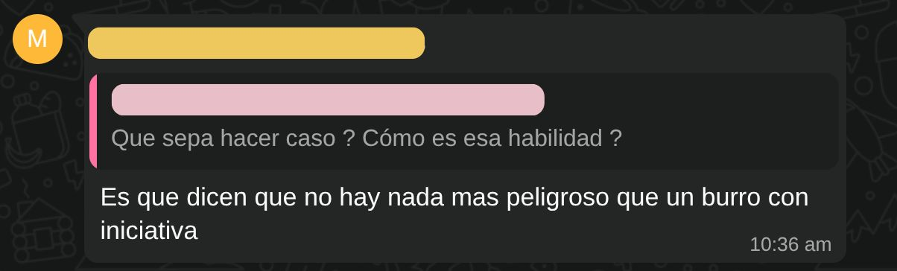

> *Originally posted on [LinkedIn](https://www.linkedin.com/posts/smuriel_ayer-en-un-grupo-de-whatsapp-pusieron-el-activity-7371535584860999680-dOIn)*

Ayer en un grupo de Whatsapp pusieron el viejo dicho 'nada peor que un burro con iniciativa' 🫏

Cero de acuerdo ❌  Nada peor que alguien sin motivación y creatividad que le permitan tener iniciativa y crear.

Si uno quiere contratar robots, ya se puede con IA. Si va a contratar personas, hay que darles espacio para crear.

