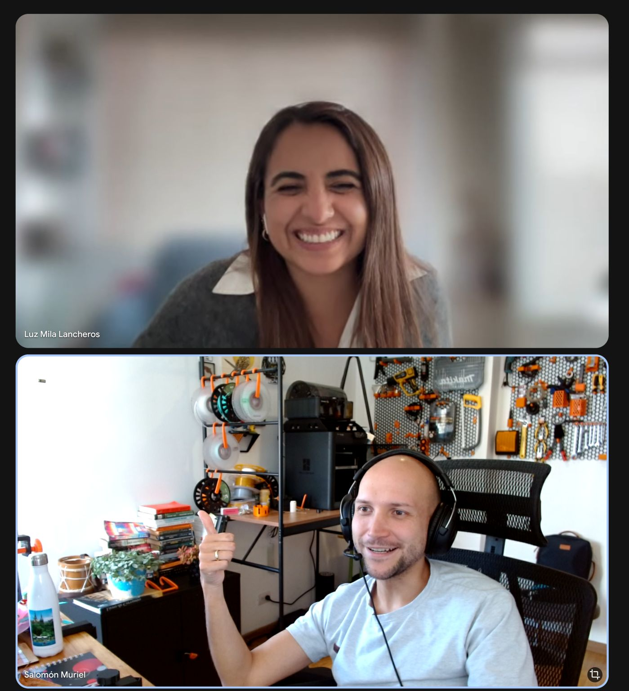

> *Originally posted on [LinkedIn](https://www.linkedin.com/posts/smuriel_aura-activity-7372260337112281088-j2pa)*

Nunca dejar de hacer networking ❌  Uno nunca sabe a quien va a conocer.

Hace algunas semanas fuí al lanzamiento de #AuRA de [IDB Lab](https://www.linkedin.com/company/idblab/) y [Fundación Bolivar Davivienda](https://www.linkedin.com/company/fundacion-bolivar-davivienda/).

Me senté al lado de [Luz Mila Lancheros Carvajal](https://www.linkedin.com/in/luzmilalancheros). Conversamos. Casualidad - conocía
a mi socio Camilo de hace rato. No tan casualidad (por el evento), está muy metida en el mundo de inversión de impacto.

Conversamos esta semana. Reu de 1 hora se fue para casi 2. Muy alineados en algunos huecos estructurales del ecosistema de inversión (tanto de impacto como más profit-driven). Mucho fuego 🔥

Creo que vamos a construir cosas poderosas 🚀 .  Y todo por hablar con la persona de al lado.

Hay que ir a eventos. Y hablar con gente (aunque de pereza, aunque no conozcan a nadie). De las conexiones salen los proyectos.

¿Qué conexiones inesperadas han hecho en un evento? ¿O en otro lugar random?

