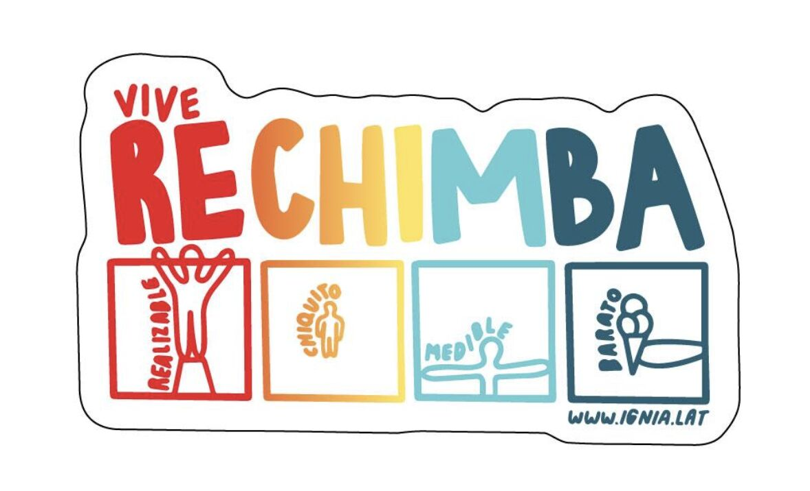

> *Originally posted on [LinkedIn](https://www.linkedin.com/posts/smuriel_en-vez-de-construir-mvps-construye-prototipos-activity-7374126318877184000-eYyX)*

En vez de construir MVPs, construye prototipos RECHIMBA 😎

Invención full de [Camilo Bonilla](https://www.linkedin.com/in/camilobonilla). Me encanta la idea, tropicalización real del MVP. Un prototipo RECHIMBA es:

**RE**alizable - Algo que puedas construir fácil, con tu equipo actual.
**CHI**quito - Con las menores funcionalidades y complejidades que puedas. Enfocarse en la esencia.
**M**edible - KPIs claros para saber si funcionó.
**BA**rato - Con la menor cantidad de recursos posibles en todo sentido. Tiempo, plata, gente.

En Ignia estamos construyendo 34 proyectos RECHIMBA con nuestros fellows 🔥 de todo - fundaciones, consultoras, proyectos tech, spinoffs de empresas. RECHIMBA aplica a cualquier proyecto

Que piensan? Le hace falta algo al RECHIMBA?

