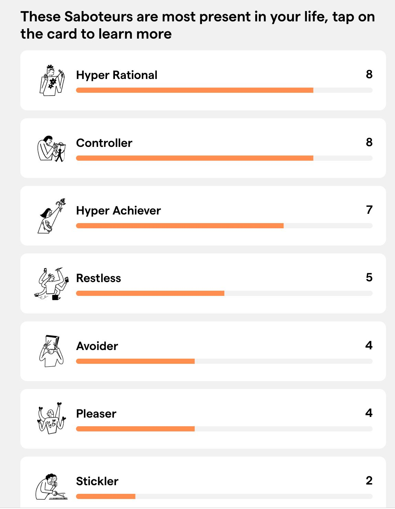

> *Originally posted on [LinkedIn](https://www.linkedin.com/posts/smuriel_c%C3%B3mo-pasar-el-el-moatfoso-de-la-verguenza-activity-7375946249805512704-6Q2O)*

Cómo pasar el El Moat/Foso de la Verguenza 🫠 - o la importancia de "hacer el oso" de vez en cuando.

Hace un rato leí un artículo de Cate Hall (blog recomendadísimo) hablando del "Moat of Low Status" - "Foso de La Verguenza" (link en los comments)

Es la "pena" que se siente al intentar hacer algo nuevo.

Ser el primero en levantarse a bailar. Romper la inercia y emprender. Decidir pasarse a una nueva industria.

Es el foso de la verguenza pq hacer algo nuevo generalmente puede causar que uno parta desde un punto "socialmente bajo" - "hacer el oso" 🐻

Estar en el centro con todos viendo. Ser el que menos sabe de algo en una reunión. Exponerse a que una idea de negocio sea mala.

[Natalia Castro Montaña](https://www.linkedin.com/in/natalia-castro-montana), en una de las sesiones del Action Lab, hablaba de los saboteadores internos. Hasta nos hizo un test - link en comments.

Esos saboteadore (el perfeccionista, el people-pleaser, el hiper-racional, entre otros), son los que no nos permiten pasar el foso, y por lo tanto los que nos impiden crear cosas nuevas o interesantes.

Tenemos que pasar el foso. Se vale exponerse a "hacer el oso" para lograr pasar de la inercia a la acción.

Les dejo mi resultado de los saboteadores. Uds que piensan? Vale la pena exponerse? Cúando les ha tocado hacer el oso para lograr cosas grandes?

