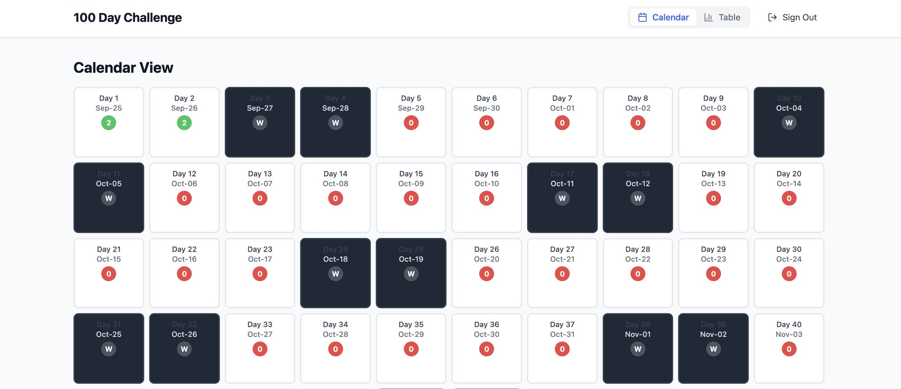
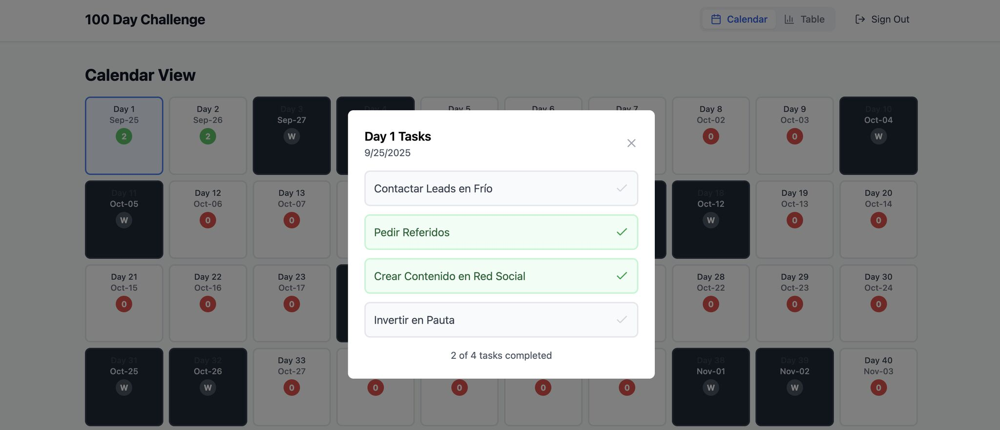
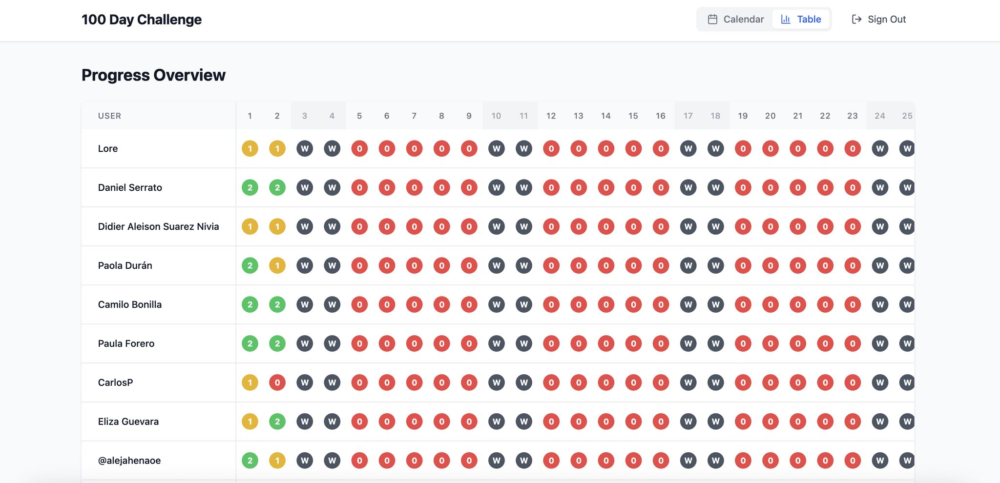

> *Originally posted on [LinkedIn](https://www.linkedin.com/posts/smuriel_estoy-en-un-challenge-de-ventas-de-100-d%C3%ADas-activity-7377703591744282624-uQK4)*

Estoy en un challenge de ventas de 100 días, y le construí un tracker para llevarle la pista.

En la última sesión del Action Lab (Ventas con [Santiago Cortes Calle](https://linkedin.com/in/santiagocortescalle) y [Laura Sánchez M.](https://linkedin.com/in/laura-sanchez-m)), nos dieron una reto - pasar 100 días haciendo acciones de ventas.

Las 4 acciones:

1. Escribir a Leads en Frío
2. Pedir Referidos
3. Hacer contenido en redes
4. Invertir algo en pauta.

En sus palabras - si hacen esto 100 días, es MUY JODIDO no vender.

Para poder llevarle la pista al tema (tanto los fellows del Action Lab como yo), construí un tracker para retos de este tipo con Bolt (y luego Claude Code).

Súper fácil: Uno le puede dar click a cada día y marcar unas tareas como hechas, y hay otra vista para ver como van los demás en el mismo reto.

Estoy haciendolo para que se puedan crear retos customizados (cambiar la cantidad de días, cuando empieza, que tareas cumplir, etc). Lo tengo esta semana.

El que quiera que se lo pase (100% gratis! Solo chévere que lo usen) escriba "TRACKER" en los comentarios. También le puedo pasar el repo a quien quiera tener el código.

