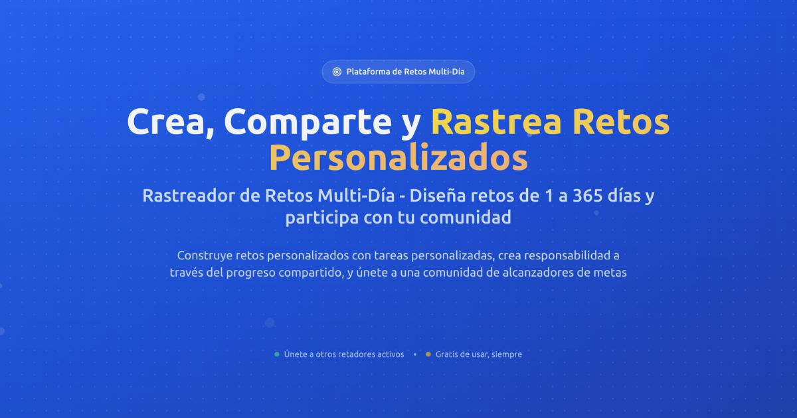

> *Originally posted on [LinkedIn](https://www.linkedin.com/posts/smuriel_100-day-challenge-tracker-create-share-activity-7379500484883304449-HNB3)*

✅ Hice un tracker de retos de grupo - se los dejo acá: [https://tracker.ignia.lat/](https://tracker.ignia.lat/)

Para Ignia nos llegó un reto - durar 100 días haciendo acciones de ventas.

Pero uno tiene retos todos los días. Para construir hábitos hay que hacerlos con constancia.

Hacer ejercicio (el que siempre pierdo 😥 ), leer, tiempo para hobbies, una tarde con los hijos, revisar KPIs de la empresa, meditar, hacer el post de redes sociales...

Y todo funciona mejor en comunidad - el accountability es clave para lograr crear esos hábitos.

Con este tracker pueden -gratis- crear retos a repetir X días de la semana, durante Y días seguidos. El de ventas de Ignia son 100 días seguidos todos los días entre semana por ej (bienvenidos a unirse!)

Me cuentan si les funciona. Que machera poder crear estos jugueticos hoy en día.

¿Alguna cosa que quisieran que le agregara? ¿Qué reto van a ponerse (y cumplir)?

