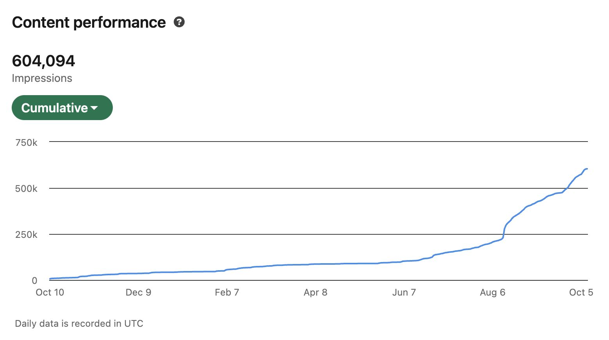
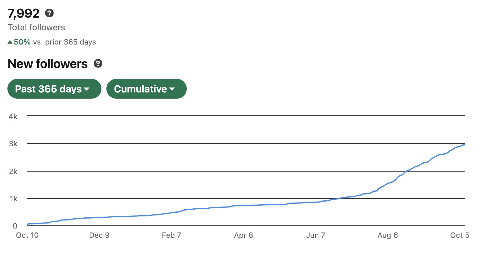

> *Originally posted on [LinkedIn](https://www.linkedin.com/posts/smuriel_hay-muchas-personas-que-llegan-a-ignia-o-activity-7382064402113646592-BEeo)*

Hay muchas personas que llegan a Ignia o mis mentorías con problemas de ventas, y cuando entramos a ver... es que siempre tienen la tienda cerrada 🫠. ¿Cómo van a vender si nunca abren?

¿Quién les va a comprar si nadie sabe lo que están vendiendo? Parece pregunta obvia, pero le pasa a emprendedores en todas las etapas.

TOCA postear a diario en al menos una red social (donde estén tus clientes).

TOCA.

Si no posteas, tienes la tienda cerrada. O al menos, una de las sucursales que más vende.

Puede que por otros canales también se venda... pero redes sociales con contenido constante es de las más efectivas.

Yo llevo desde finales de Junio en forma. El efecto en TODO es notorio - se abren más puertas, se generan ventas (50% del Action Lab 1.0 se vendió por mis posts de LinkedIn), se mantiene la tienda abierta y andando.

Si no ha empezado, hágale. Si no sabe como, es fácil: 1. Hagan su primer post ya. 2. Miren el contenido de [Pedro Mejia](https://linkedin.com/in/pedromejiar) y [manuela villegas](https://linkedin.com/in/manuelavillegas). 3. Siga posteando a diario.

Mantenga su tienda abierta.

Mis resultados - Con este post llego a 8K seguidores y +600K impresiones 🔥 Función directa de hacer esto a diario.

De Octubre 10 2024 a Junio 27 2025 subí 1000 seguidores (sin mover mucho redes). 1000 seguidores en 230 días, 4.3 al día.

De Junio 28 a hoy subí 1946 seguidores. 1946 en 105 días. 18 al día.

Quien quiera, le ayudo. Le boto lo que me enseñó Pedro. Mejor, le doy descuento pa que entre al Action Lab del próx año y haga esto (con Pedro en persona) y más (con otros cracks) para vender 10x lo que vende hoy. Solo escríbanme por interno.

Cómo sea, no hay excusa. TOCA!

