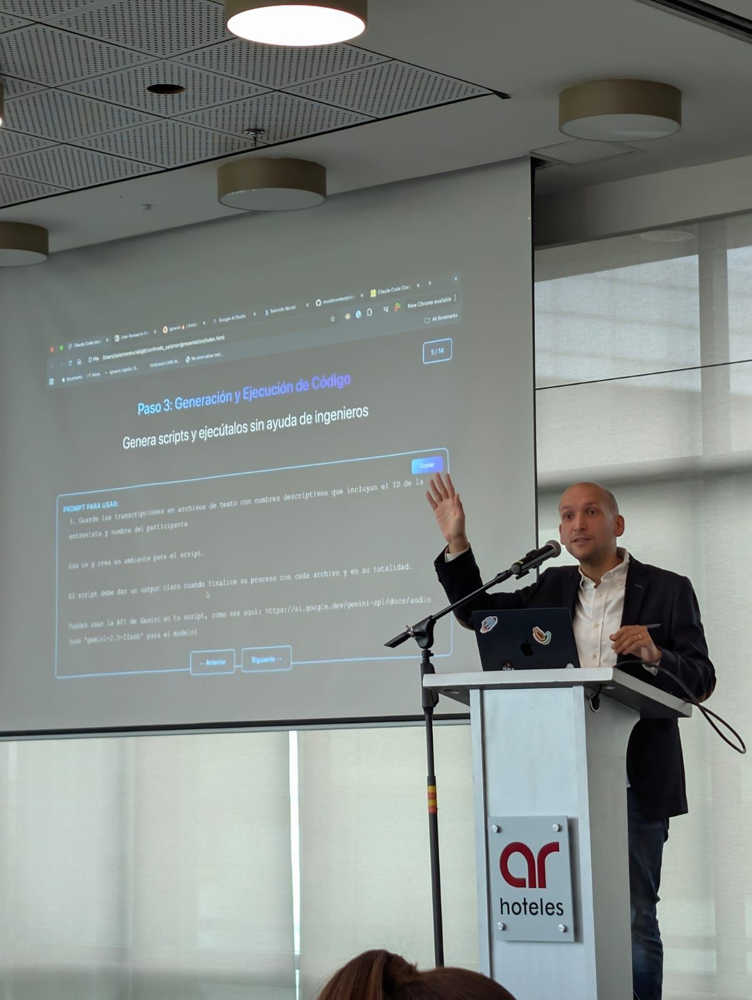

> *Originally posted on [LinkedIn](https://www.linkedin.com/posts/smuriel_confnodo-activity-7382871493690540032-mDXy)*

Hoy desde #ConfNodo - hablando de como usar Claude Code para Product Management - para multiplicarse 10X en cosas no técnicas.

Les dejo link a la charla si alguien quiere ver el contenido, la grabación vendrá pronto cortesía de [Pm Beers-Product Club](https://www.linkedin.com/company/pmbeers/). Gran evento 🔥

Link: [https://lnkd.in/e6yAB4hK](https://lnkd.in/e6yAB4hK)

[María Alejandra López Concha](https://linkedin.com/in/malejandralopez) y [Alvaro Pinzon](https://linkedin.com/in/alvaroandrespincor), gracias por la invitación! Que machera compartir el espacio y ver tantas caras conocidas [Danny Bravo](https://linkedin.com/in/dannybravo) [Natalia Castro Montaña](https://linkedin.com/in/natalia-castro-montana) [Elizabeth Guevara Sandoval](https://linkedin.com/in/elizabethguevara-projectmanager).

El próximo año será aún más grande, mejor irse reservando!

