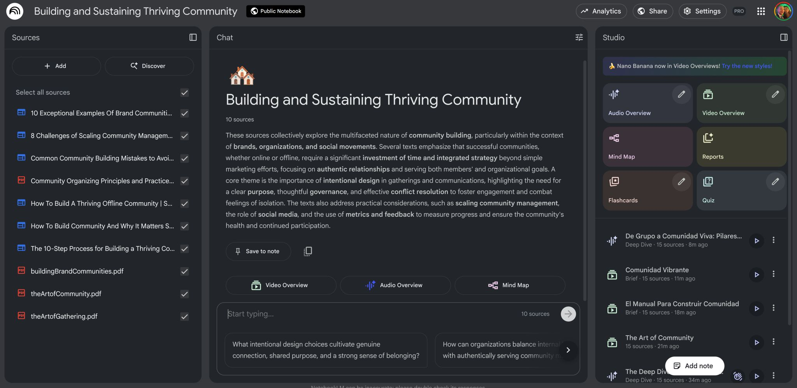
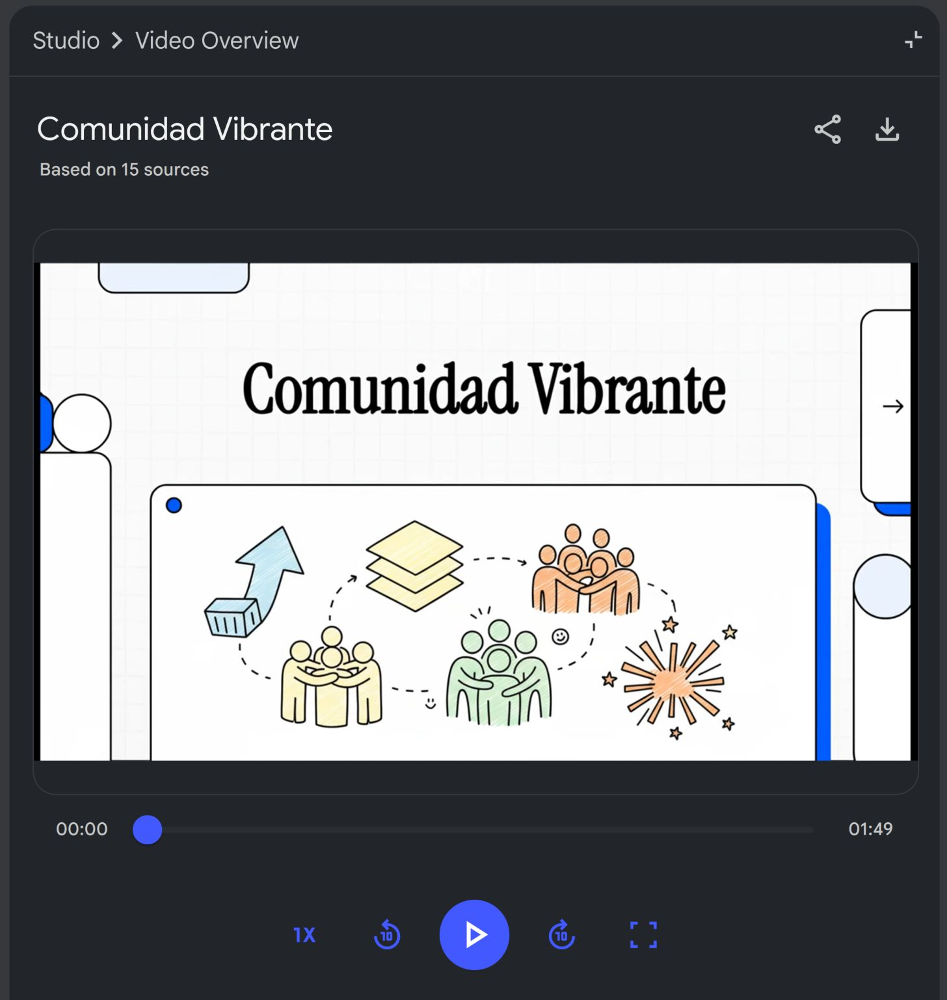
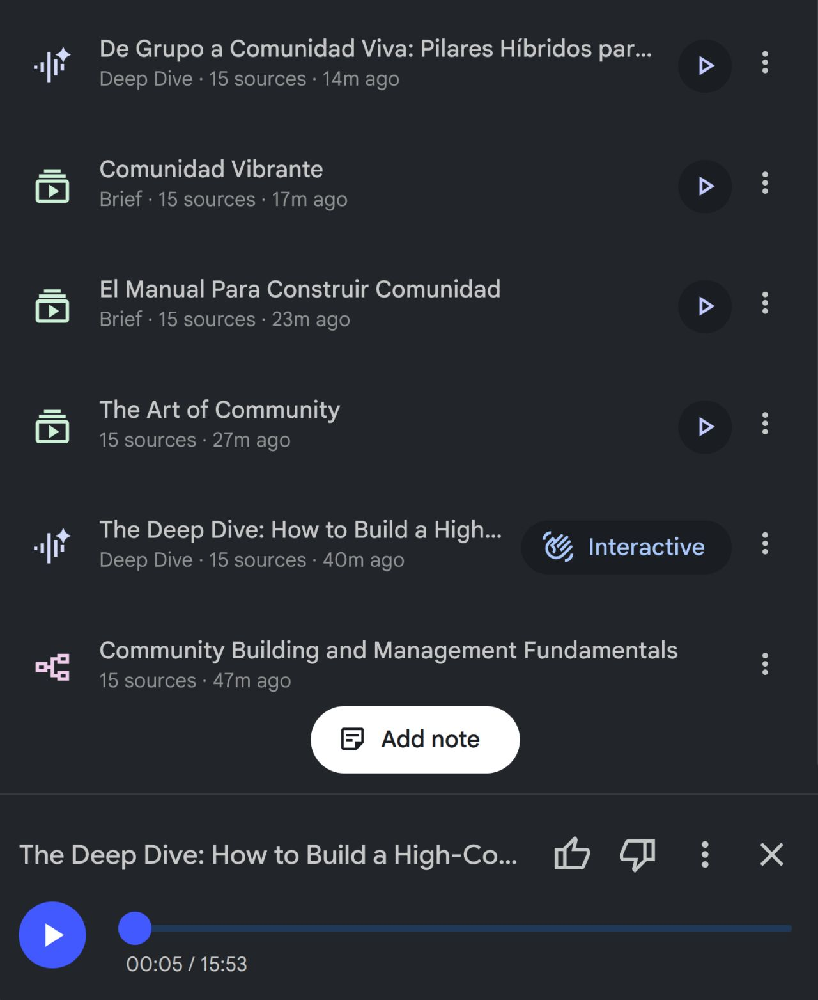
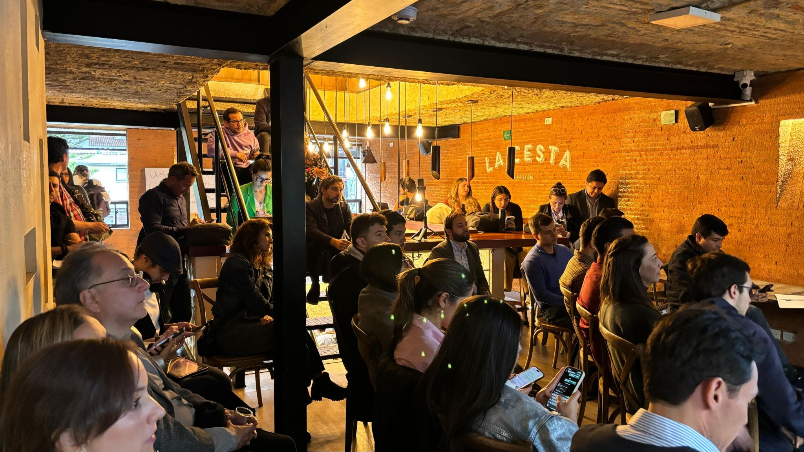
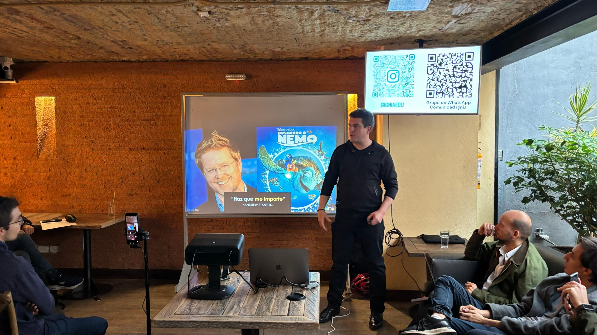

> *Originally posted on [LinkedIn](https://www.linkedin.com/posts/smuriel_estamos-logrando-crear-una-comunidad-vibrante-activity-7387526894948081664-V94B)*

Estamos logrando crear una comunidad vibrante (100+ miembros activos en menos de 3 meses) con este NotebookLM. ¡Se los comparto!

Hoy, estoy dando gratis mi NotebookLM con todas mis fuentes, videos explicativos, podcasts, etc para quien quiera crear una comunidad.

Ayer en nuestro Jueves de Coworking [Emma Barrientos Arismendi](https://linkedin.com/in/emma-barrientos-arismendi) me preguntaba - ¿cómo se construye una comunidad?

Con este NotebookLM me estudié muchas fuentes del tema. Mi top 3 de cosas a tener en cuenta:

1. Propósito Claro - La comunidad debe tener una idea clara de que la une. En el caso de Ignia es juntar personas con fuego 🔥
2. Constancia - La constancia es todo. Ya sea semanal, mensual, lo que sea - que NUNCA se cancele.
3. Ser activo - No se puede ser 'host chilleado'. Toca recibir a la gente, conversar, estructurar y así crear engagement.

Construí un NotebookLM muy completo con TODO lo que he aprendido de esto. Incluye:

✅ PDF a los 3 libros más completos del tema (The Art of Gathering, the Art of Community y Building Brand Communities)
✅ Artículos Web que más me gustaron del tema
✅ Podcasts, videos y mindmaps que he creado estudiando el tema.
✅ Pueden chatear YA con el contenido para usarlo de inmediato.

Solo tienen que:
╰┈➤ Comentar 📌 "COMUNIDAD" 📌
+ 🔔 Conectar conmigo
+ ✍ Les envío al inbox

PD - Les dejo foticos del NotebookLM + fotos del jueves de Coworking de ayer (llegaron en total +80 personas!!!)

