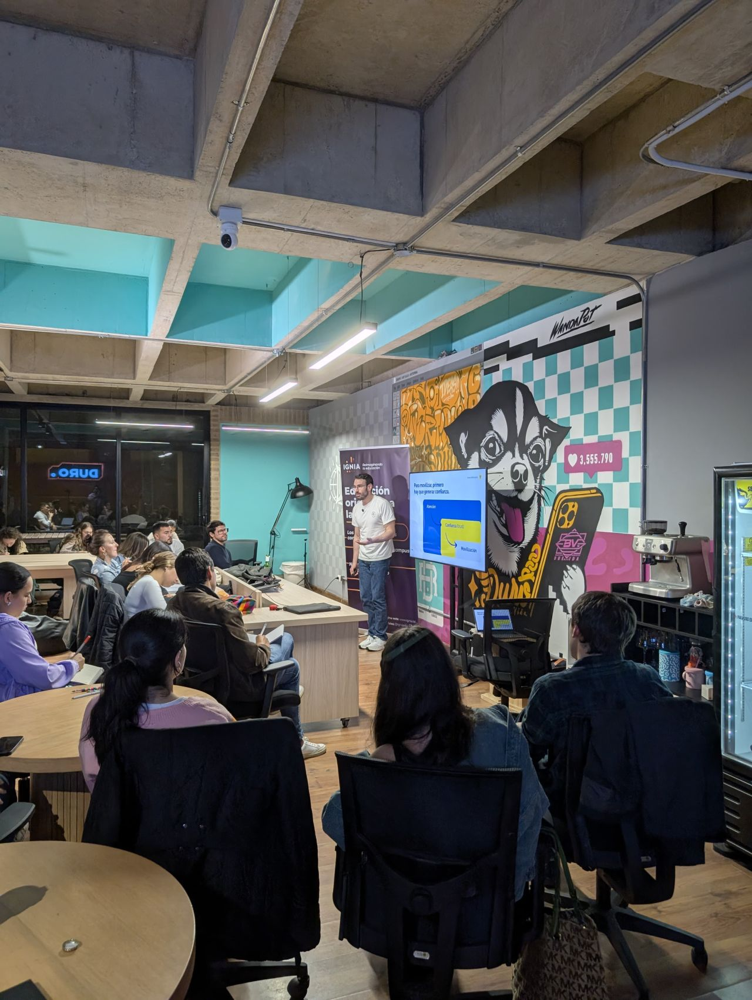

> *Originally posted on [LinkedIn](https://www.linkedin.com/posts/smuriel_ethos-pathos-logos-credibilidad-emoci%C3%B3n-activity-7389783169287286785-jbJ7)*

Ethos-Pathos-Logos. Credibilidad 🏆 , Emoción ❤️ , Lógica 🧠 . Cómo contar historias desde todos los ángulos humanos, resumido en 3 palabras.

Ayer en la sesión del Action Lab tuvimos en carne y hueso al crack [Pedro Mejia](https://linkedin.com/in/pedromejiar) hablando de marca personal. Crack 🔥 

Que machera ha sido presenciar el cómo aplicar estos 3 conceptos gracias al Action Lab. 

Con [Jose Duarte](https://linkedin.com/in/joseduarteq) y [Luis Felipe Barrientos Moreno](https://linkedin.com/in/luis-felipe-barrientos-moreno) lo entendí aplicado a nuestros proyectos - pero hasta ahora entiendo como aplicarlo a mi mismo.

Hablar desde lo que has hecho, contar desde sus vivencias, mostrar datos reales. Ethos-Pathos-Logos.

Tenemos que contar historias que enamoren - para que se contagien nuestras ideas.

Cual es tu ethos? Cuál es tu pathos? Cuál es tu logos?

