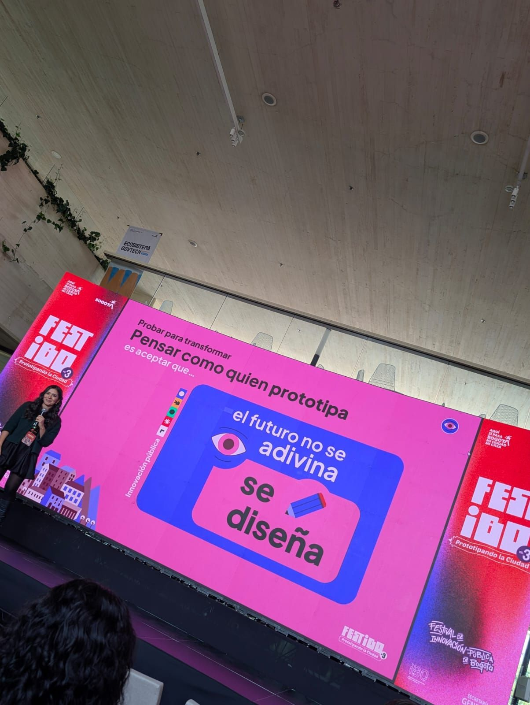
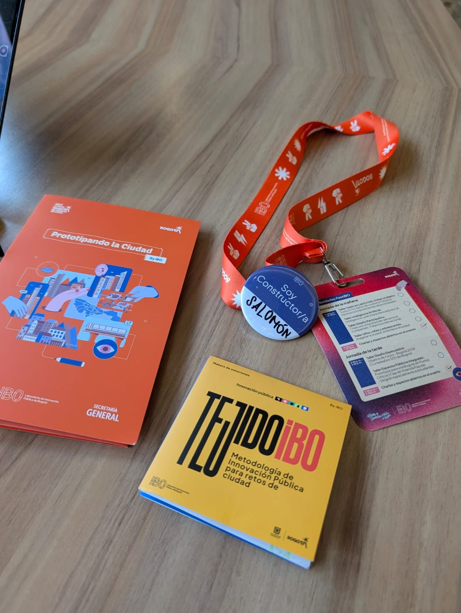

> *Originally posted on [LinkedIn](https://www.linkedin.com/posts/smuriel_festibo-activity-7394411011711270915-x6Pr)*

Este post viene desde el orgullo - por la innovación, por Bogotá y por [Natalia Rodríguez Triana](https://linkedin.com/in/nat-innovacion) (aunque tal vez el orden sea al revés).

Estoy en #festIBO, el Festival de Innovación Publica de Bogotá. Aprendiendo cómo desde lo público SI ES POSIBLE prototipar e innovar.

Organizado por [IBO Laboratorio de Innovación Pública de Bogotá](https://www.linkedin.com/company/ibo-laboratorio-de-innovaci%C3%B3n-p%C3%BAblica-de-bogot%C3%A1/). Recientemene institucionalizado - demostrando que la ciudad SÍ LE CREE a invertir en innovación.

Desde hace unos díás, liderado por [Natalia Rodríguez Triana](https://linkedin.com/in/nat-innovacion) - su nueva Directora (y mi esposa, que suerte la mía ❤️ ). Demostrando que el diseño no solo tiene cabida en lo público - puede ser su motor.

Que increíble ver a Natalia y a su equipo no solo luchar por que la innovación suceda - sino que sea demandada por las entidades en la ciudad.

Speakers de talla mundial, talleres abiertos, participación ciudadana - diseño impecable para un gran evento. Hay que planillarse desde ya para el próximo.

Hace unos años leiamos "We The Possibility" de [Mitchell Weiss](https://linkedin.com/in/mitchellbweiss) -un libro increíble despertando la pasión por innovar en lo público, por creer que sí es posible- a través de ejemplos reales de todo el mundo.

Hoy veo esa pasión, ejecución y resultados reales en Bogotá. En IBO. En Natalia.  Que orgullo 🚀  Cómo bien dijo Natalia en su charla - el futuro no se adivina. Se diseña.

