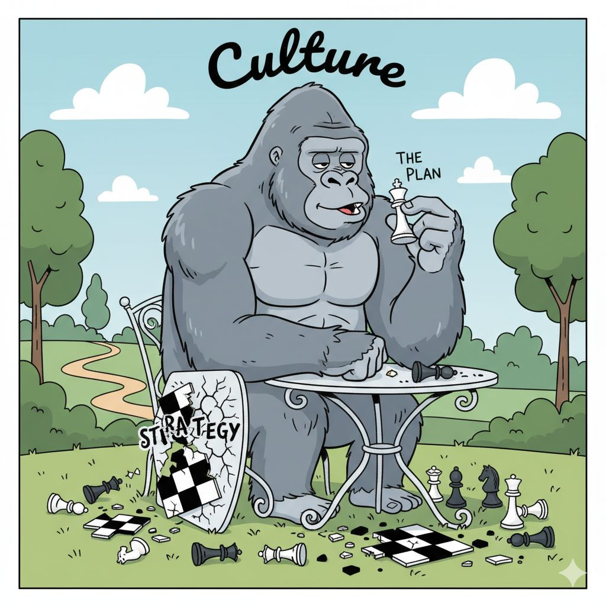

> *Originally posted on [LinkedIn](https://www.linkedin.com/posts/smuriel_culture-eats-strategy-for-breakfast-activity-7395110089465942016-ugIM)*

Culture eats strategy for breakfast 🥞 . Construir equipo (con buena cultura) es jodidisimo. 

Esta semana tuvimos nuestra primera contratación en Ignia - y da muchísimo miedo.

1. Qué cultura queremos crear? Hoy con mi socio se 'siente' la cultura - pero no la tenemos escrita.
2. Cómo comunicarla? No es solo escribirla - toca demostrarla.
3. Cómo mantenerla? La cultura debe tener 'recorderis' - acciones + rituales particulares que la hagan sentir viva.

No soy experto pero se la importancia. [Pablo Armida](https://linkedin.com/in/pabloarmida), [Fernando Sucre](https://linkedin.com/in/fernandosucre) y [Ricardo Buitrago](https://linkedin.com/in/ricardo-buitrago) me lo enseñaron de primera mano en R5.

Pregunta honesta. ¿Cómo creen uds que son las mejores maneras de construir cultura en equipos nacientes?

