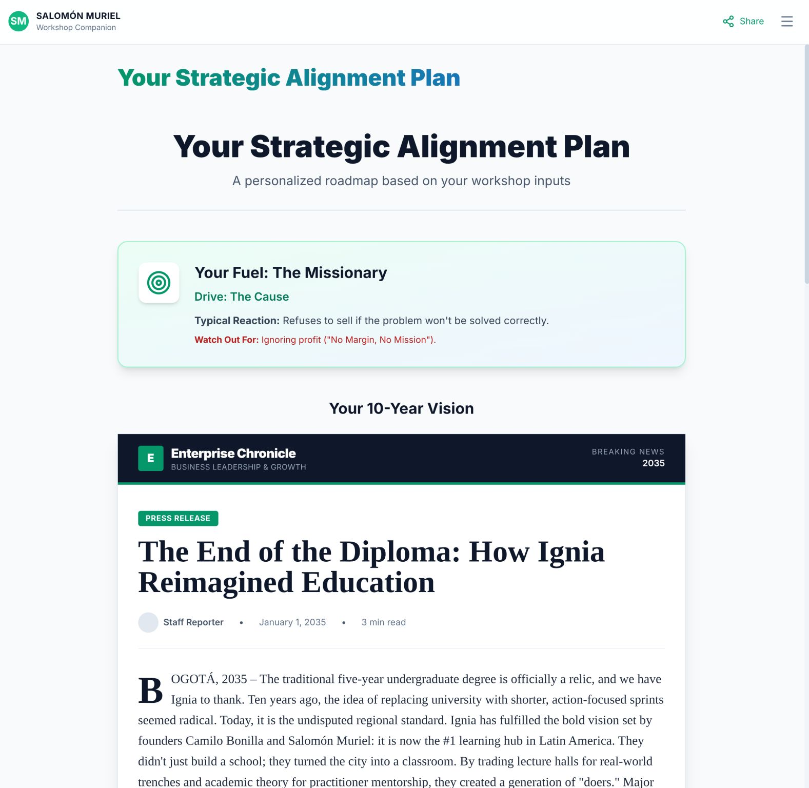
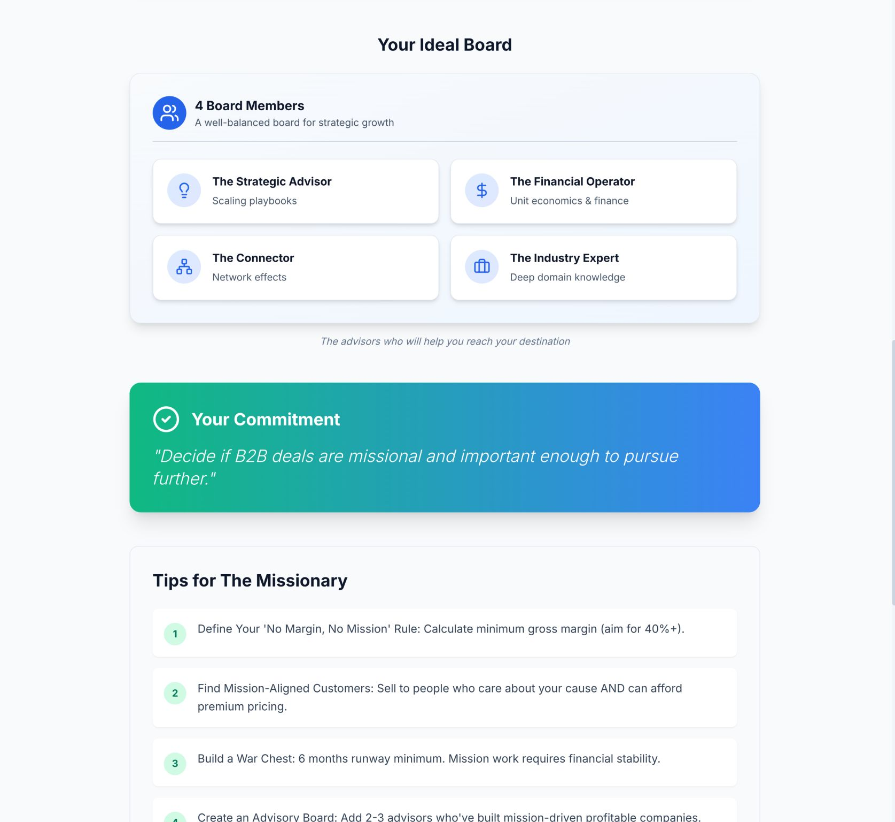
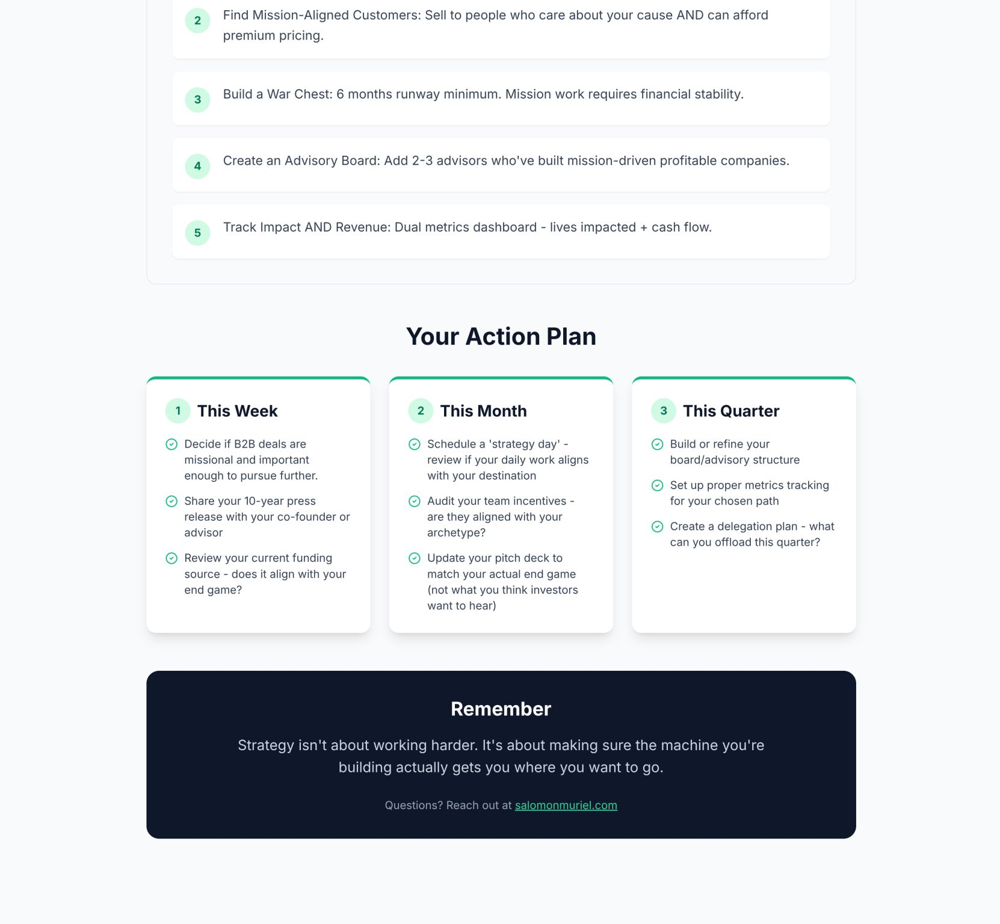

> *Originally posted on [LinkedIn](https://www.linkedin.com/posts/smuriel_montar-empresa-es-un-medio-para-un-fin-activity-7397672379339919360-rawN)*

Montar empresa es un medio para un fin - hacia dónde estás construyendo? ➡️ Hice una Herramienta para que lo averigues, te la comparto abajo ⬅️ 

Muchos nos quedamos en un loop de operar operar operar y se nos olvida la meta.

Nos mueve el reto intelectual / técnico 🧠 ? La misión/causa 🕊️ ? La plata 💸 ? Estamos tomando decisiones acordes a eso?

Ayer [Halcyon Inspires](https://linkedin.com/in/halcyon-inspires-1908a6297) (thx [Mala Henriques](https://linkedin.com/in/malahenriques)) me invitaron a dar una charla a sus Fellows del LAC Climate Fellowship - ~20 emprendedores solucionando problemas de clima.

Tenemos que caer en cuenta que cada decisión estratégica hoy debe responder a esa meta. Mis incentivos y motivaciones están alineados a mis stakeholders?

No tiene sentido buscar plata de VCs si nunca quiero vender la empresa 🙅‍♂️ . No tiene sentido traer empleados a corto plazo si quiero hacer una empresa de por vida. No tiene sentido tener un co-founder que quiere construir una empresa de alto impacto si yo quiero mantenerla chiquita.

Monté para la charla una presentación interactiva (usando Gemini 3!) donde cada persona podía responder estas preguntas y llegar a un resultado compartible para conversar con sus socios, su junta, sus inversionistas - y alinear visiones, misión e incentivos.

➡️ ¿Qué creen que es importante a la hora de tener estas conversaciones estratégicas con socios, inversionistas, junta o empleados? ¿Cómo solucionar si no las tuviste y ahora hay un mismatch?

▶️ Deja tu opinión (o respuesta a otro comment también vale) y te paso la PPT + herramienta por interno!

