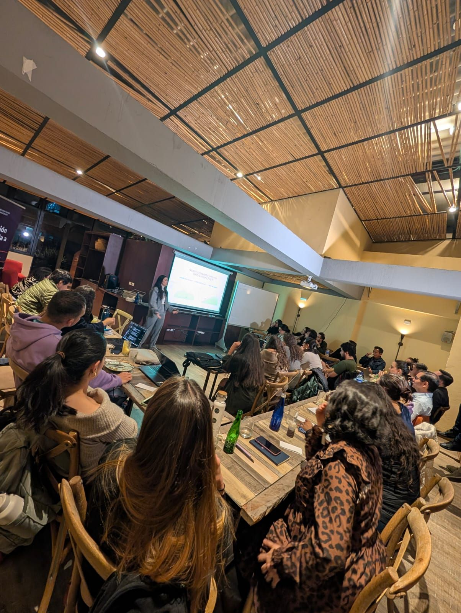

> *Originally posted on [LinkedIn](https://www.linkedin.com/posts/smuriel_fabricar-un-par-de-jeans-gasta-10000-litros-activity-7399831715105488896-7hqM)*

Fabricar un par de Jeans gasta 10.000 litros de agua 🤯 

Ayer [Ana Jiménez Sánchez](https://linkedin.com/in/anajimenezs) de [GoTrendier](https://www.linkedin.com/company/gotrendier/) dio la sesión de Sostenibilidad del Action Lab (junto a [Estefanía  Abello Plata, CFA](https://linkedin.com/in/estefania-abello-plata) de [MUTA](https://www.linkedin.com/company/muta-app/)), y me dejó boquiabierto con el dato.

WTF? 10.000 litros 🌊 . Eso es una piscina pequeña!

Fue muy emocionante ver como se crean negocios que crean impacto real, amarrado directamente a su modelo de negocio. 

Por cada jean que se vende en GoTrendier, ahorramos 10.000 litros de agua + el vendedor gana plata + la compradora se lleva algo cool + GoTrendier se lleva una comisión.

Hay que salirse de modelos de impacto llevados por donaciones. Este es el verdadero modelo - el impacto amarrado a los resultados financieros.

¿Qué otras empresas conocen con modelos así? Que creen impacto no a costa de las utilidades sino en conjunto con ellas .

PD - Estefanía y MUTA también increíble, mañana escribo lo que aprendí.

