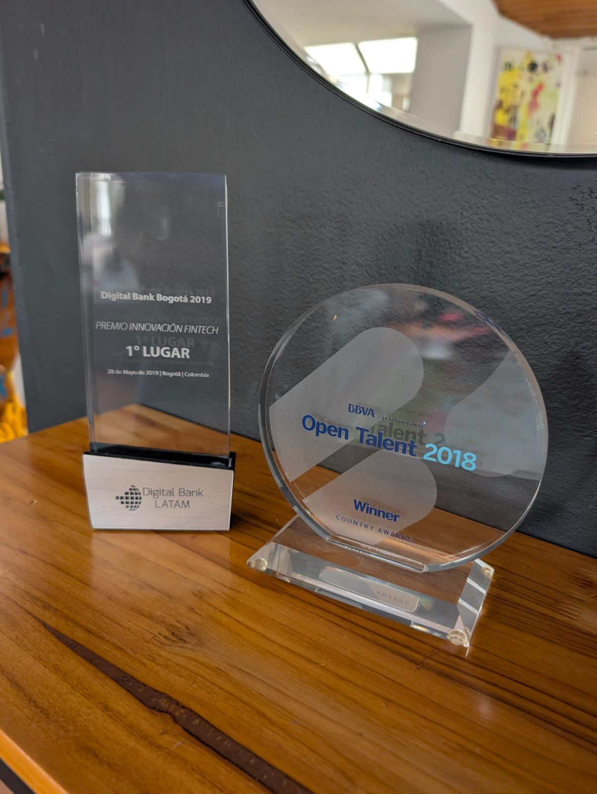

> *Originally posted on [LinkedIn](https://www.linkedin.com/posts/smuriel_estos-son-mis-viejos-premios-de-emprendimiento-activity-7401629695718506496-JfCn)*

Estos son mis viejos premios de emprendimiento - hoy me dan 0 orgullo 🫠 

Cuando me gané estos premios (+ otro que se rompió), mis empresas no eran rentables (y nunca iban a serlo).

Me los gané con parla - en una presentación frente a muchas personas, contagiando de emoción y sueños. 

Pero por detrás, no había mucho - una idea, algo de tecnología (y muy escueta a decir verdad), poca o nula facturación.

Me los gane con humo 🌪️ . Vendiendo humo, contagiando humo.

Ya no estoy orgulloso de vender humo. Ya no voy a eventos a buscar premios.

Prefiero ganarme el premio de tener una empresa rentable - el trofeo ya no es importante. 

Y nada de malo en ir a los concursos y eventos - dan visibilidad y validación de mercado. Puede que vuelva.

Pero ojalá, ojalá, se los ganaran empresas con buenas métricas detrás - no solo buenas ideas y buenos vendedores de sueños.

