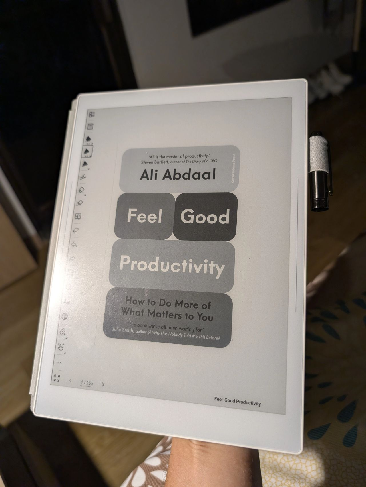

> *Originally posted on [LinkedIn](https://www.linkedin.com/posts/smuriel_mi-primer-libro-del-club-de-lectura-para-activity-7408854148340817920-QCX5)*

Mi primer libro del club de lectura para emprendedores de [Miguel Vanegas Torres](https://www.linkedin.com/in/miguelvanegas) - Feel Good Productivity 🚀

Nunca me he leído más de 5 libros en un año. Meta - 10 en 2026.

Otros que quisiera leer este año:

1. Thinking, fast and slow.
2. Build
3. The Innovator's Dilemma

¿Uds qué libros me recomiendan para tener en la lista?

