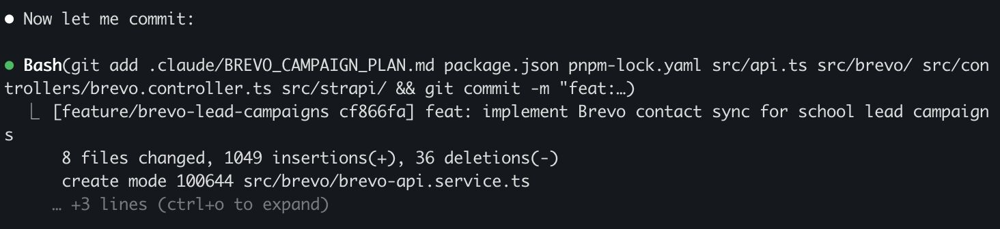

> *Originally posted on [LinkedIn](https://www.linkedin.com/posts/smuriel_%C3%BAltimo-commit-del-a%C3%B1o-con-claude-code-obvio-activity-7412203564065857536-Tj0d)*

Último commit del año. Con Claude Code, obvio 🤖

En 2025, eché código solo de Sept a Dic e hice 493 contribuciones en Github. Y mi trabajo solo es como 40% de programación.

En 2021, que mi trabajo era 80% programar, hice 706 contribuciones en todo el año.

164 al mes vs 60 al mes. 2.5X. Y pensando en el tiempo que pasaba realmente programando, 5X.

Y la calidad de las del 2025 fue muchísimo, muchísimo mejor que las del 2021 (o cualquier otro año de mi vida).

El que no se haya montado al bus a este punto está loco. No hay como competir si no se programa con AI.

