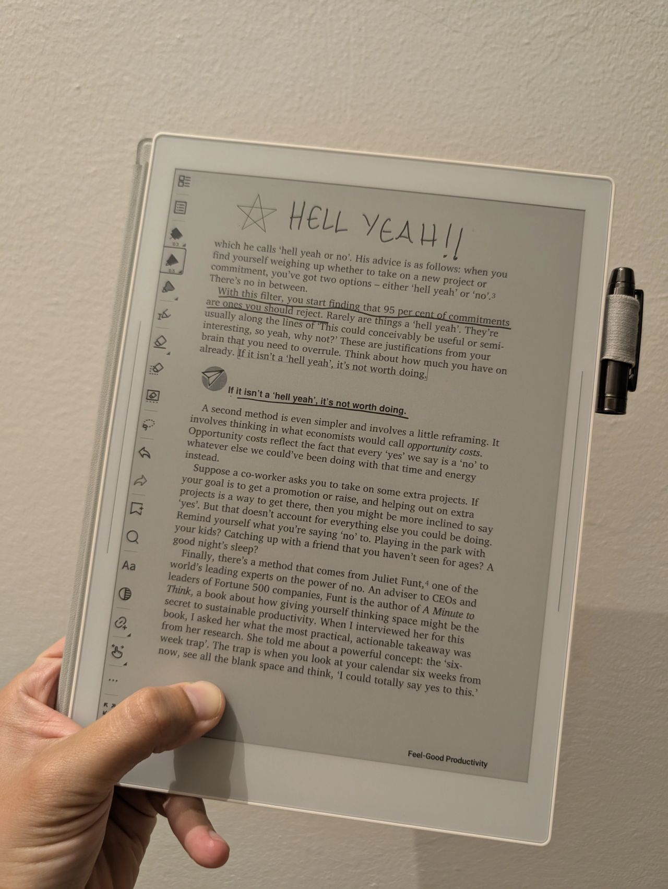

> *Originally posted on [LinkedIn](https://www.linkedin.com/posts/smuriel_hay-que-decir-no-m%C3%A1s-seguido-el-mejor-m%C3%A9todo-activity-7415021986885681152-xjsf)*

Hay que decir no más seguido. El mejor método que he visto - Hell yeah 🤩 o No ❌

Vi un post de [Felipe Novoa](https://www.linkedin.com/in/felipenovoaufk) acerca de cómo a muchos emprendedores les cuesta enfocarse y quedarse en una cosa - nos encanta iniciar cosas nuevas.

Me pasa un montón - quiero estar en todo. que sí a cada proyecto, a cada charla. ya veré de dónde saco tiempo.

El año pasado [Mauricio Salazar Velez](https://www.linkedin.com/in/mauriciosalazarvelez) me dijo muy respetuosamente que ya había pasado la fase de la "saperia 🐸" - lo de estar en todo.

Ya entiendo a Mauricio - es que hay que elegir muy bien en que se invierte el tiempo.

Y eso se hace diciendo que no a la mayor parte de cosas que llegan - al 99%. más fácil decirlo que hacerlo.

▶️ La táctica - si algo es un "Hell Yeah 🔥" (osea, IMPERDIBLE INCREÍBLE ESPECTACULAR), le decimos que sí.

A cualquier otra cosa, le decimos que no.

Lo ví en Feel-Good Productivity, pero el crédito original al parecer es de @Derek Sivers a quien de casualidad conocí hace un año.

Me hace todo el sentido. Si no se ve como algo increíble, seguramente me está desenfocando de lo más relevante.

Voy a empezar a aplicar este año a ver si me siento menos ahogado, a ver si logro que menos pelotas se me caigan malabareando cada semana.

¿Cómo les parece? ¿Que otras tácticas usan para "cuidar" su tiempo?

