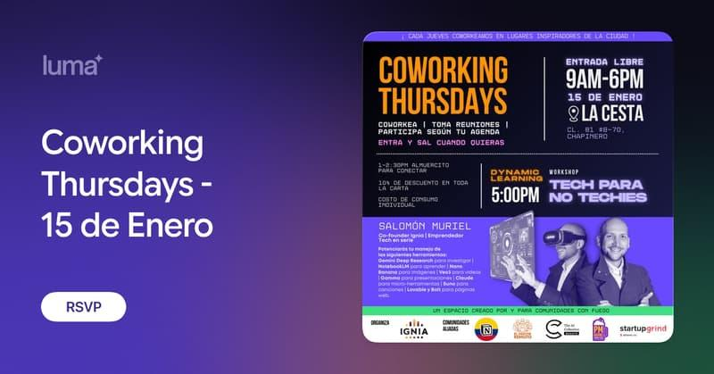

> *Originally posted on [LinkedIn](https://www.linkedin.com/posts/smuriel_coworking-thursdays-15-de-enero-luma-activity-7415384395622191104-1Oqt)*

Si estás en Bogotá, volvieron nuestros Jueves de Coworking 👇

Un espacio para conocer a más personas con fuego por CREAR de todo. Y así mover el cerebro.

Vienen creadores de empresas, de fundaciones, de proyectos, de arte, de impacto, de movimientos, de startups, de comunidades. Y quiénes quieren serlo algún día.

En otras palabras, vienen personas con fuego 🔥

Funciona fácil - estamos de 9am a 5-6pm cada jueves. Entrada gratis (pero registro previo). Lo hacemos en algún café inspirador de la ciudad.

Llegas a la hora que quieres, sales a la hora que quieres. Los que estemos a las 12m ahí, almorzamos juntos.

Y al final de la tarde hay una charla o taller inspiradora con invitadxs diferentes cada semana.

Normalmente llegan entre 30 y 60 personas durante el día. Todas las semanas 🚀

▶️ El primero del año es el Jueves 15 de Enero en La Cesta de la Calle 81 (de hoy en 8). El taller de la tarde será de "Tech para no Techies", como usar IA para temas cotidianos de vida y trabajo (dado por mi, una charla un poco frenética ⚡)

Les dejo el link de registro:

[https://luma.com/6o3sapi3](https://luma.com/6o3sapi3)

Taggeo a quienes me habían preguntado cuando volvían [David Mauricio González Roa](https://www.linkedin.com/in/david-gonzalez-educacion-edtech-inteligencia-artificial) [Marcela Escovar Aparicio](https://www.linkedin.com/in/marcela-escovar) [Natalia Castro Montaña](https://www.linkedin.com/in/natalia-castro-montana) [Camilo Ramírez](https://www.linkedin.com/in/camiloramirez) [Luis Felipe Barrientos Moreno](https://www.linkedin.com/in/luis-felipe-barrientos-moreno) [Ignacio Salcedo](https://www.linkedin.com/in/isalcedo-dev)

PD: Vamos a lanzar varias sorpresas para los asistentes recurrentes - cortesía de [Adriana Portilla Llaña](https://www.linkedin.com/in/adrianaportilla1). Pronto les contamos.

