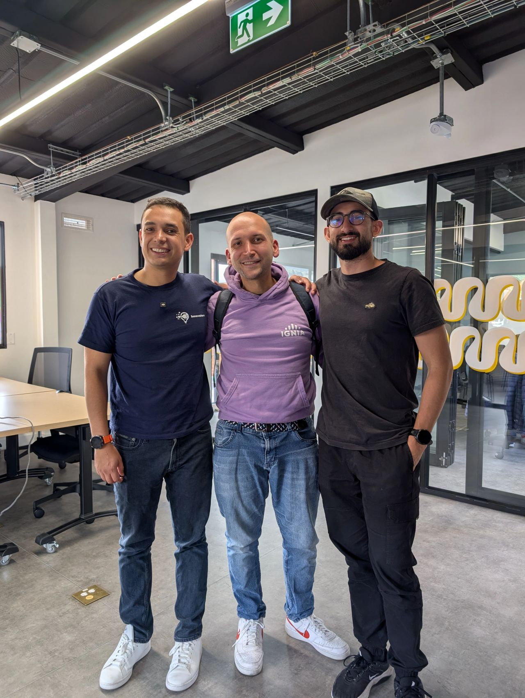

> *Originally posted on [LinkedIn](https://www.linkedin.com/posts/smuriel_una-cerveza-con-luis-felipe-barrientos-moreno-activity-7417577899035254784-GMPU)*

Una cerveza con [Luis Felipe Barrientos Moreno](https://www.linkedin.com/in/luis-felipe-barrientos-moreno) me abrió los ojos a lo importante de contar historias.

No hacer presentaciones. No hablar y ya.

Contar un cuento bien contado.

Esa cerveza llevó a mi primera historia preparada. Día y noche vs "hacer una presentación".

Quiero este año contar historias muchas veces - de lo vivido y de lo que viene.

[Santiago Grisales](https://www.linkedin.com/in/santiago-grisales-bohórquez) me invitó a contar la primera del año en su podcast. Y me regaló un libro 📖. Y buen café y buena conversa.

Pronto en su Podcast Remando en Arequipe - una historia de los fracasos, éxitos en insights de cómo innovar emprendiendo.

Gracias Santi por la invitación y ayudarme a dar el primer paso de cumplir mi meta!

Bonus: reencontrarme con [Alejandro Uribe Lopez](https://www.linkedin.com/in/dauribel) de mi época en DS4A. Nos quedamos una hora echando Lora de Claude Code, transformación digital y adopción de nuevas tecnologías. Sumando a la meta de conocer gente interesante 🔥

Uds, que historia quieren contar que no han contado? busquemos el espacio - en un café, en los jueves de coworking.

