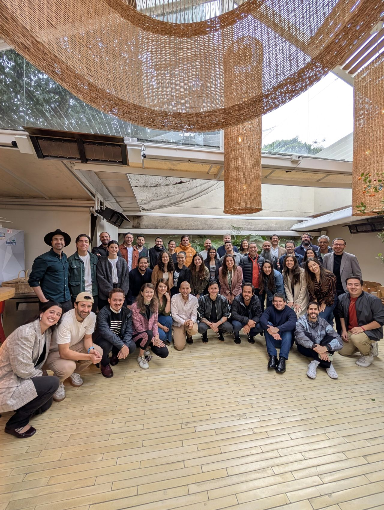

> *Originally posted on [LinkedIn](https://www.linkedin.com/posts/smuriel_esta-foto-era-imposible-hace-1-a%C3%B1o-tuvimos-activity-7420095229946417152-6jjh)*

Esta foto era imposible hace 1 año.

Tuvimos nuestro Kickoff del año - el desayuno de Aliados y Profes de Ignia.

50 cracks - 50 creyentes - 50 personas ayudándonos a empujar este sueño de reinventar la educación superior.

Sector social, gobierno, empresarial. De startups tech, empresas tradicionales, fundaciones. Líderes de opinión, de industria, de gremios, de comunidades.

Mucho fuego 🔥 una comunidad que junta tiene TODO para lograr que se dé el cambio que buscamos.

A todxs: GRACIAS GRACIAS GRACIAS. Por lo que pasó y lo que viene.

Esto apenas empieza.

