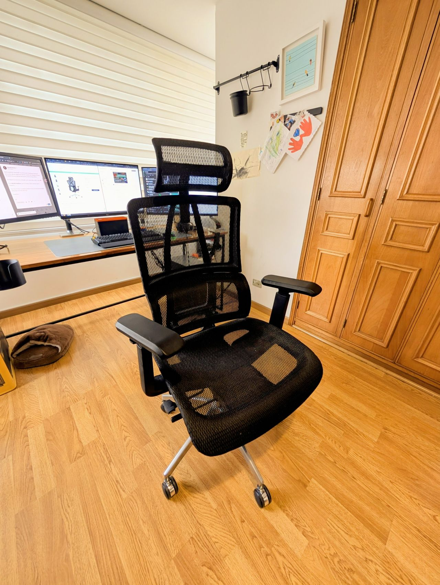

> *Originally posted on [LinkedIn](https://www.linkedin.com/posts/smuriel_mi-segundo-gadget-preferido-de-trabajo-activity-7421583417319968768-qzih)*

Mi segundo gadget preferido de trabajo - mi silla 🪑

Pasé la pandemia "encerrado" en una finca de mi familia por Apulo (por pura suerte, allá me cogieron los cierres). Cuando volví a Bogotá y ví que la virtualidad iba a ser más bien permanente, invertí en home office.

Ahí llegaron los monitores, el teclado - pero sobre todo, la silla. La amo ❤️

Es de [BOUND Mobiliario](https://www.linkedin.com/company/bound-mobiliario/), para mi la mejor opción (de lejos) para la categoría.

Paso unas 20 horas a la semana sentado en ella (y en esa época de código y videojuegos más como 60-70 🫣)

Es perfecta - soporte espalda alta, baja, súper cómoda en dónde más cuenta (las nalgas jejeje), ajustable todo (altura, cabecera, cuánto se reclina, descansa-brazos, como la parte lumbar).

Ya van 5 años y aún está como nueva (y con mis chiquis saltándole encima seguido)

¿Uds cuál tienen? También he pensado en cambiarme a standing desk pero no he dado el paso. ¿Vale la pena?

