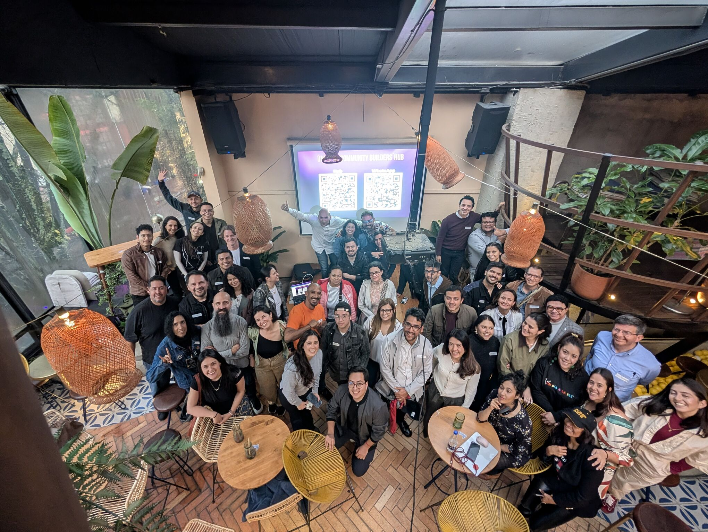

> *Originally posted on [LinkedIn](https://www.linkedin.com/posts/smuriel_ayer-fue-el-primer-meetup-de-community-builders-activity-7421927689420255232-gund)*

Ayer fue el primer Meetup de Community Builders de Bogotá 🤩

Una meta-comunidad - una comunidad de creadores de comunidades.

Una idea nacida de la nada, en una mini-conversación con [Tim Bonnemann](https://www.linkedin.com/in/tbonnemann) y [Adriana Portilla Llaña](https://www.linkedin.com/in/adrianaportilla1).

Y un post de LinkedIn que se toteo - +100 inscritos, y a pesar del DILUVIO de ayer, más de 50 asistentes.

Que machera ver como se dió todo. Teníamos 3 charlas de 5 mins planeadas, pero luego se volvió un Open Mic de compartir acerca del arte de juntar personas:

1. [Luis Betancourt](https://www.linkedin.com/in/luisbetancourt) hablando del ciclo de vida de una comunidad.
2. Yo mostrando de usar tech para manejar una comunidad presencial.
3. [Tim Bonnemann](https://www.linkedin.com/in/tbonnemann) contando de sus 20 años como Community Architect.

🪄 Y la magia de lo orgánico - sin planearlo se levantaron varixs a hablar:

4. [Rogert Ovalle](https://www.linkedin.com/in/rogertovalle) el primer valiente, contando de como ha visto muchas comunidades nacer y morir.
5. [Carolina Laiton Galán](https://www.linkedin.com/in/carolinalaiton) con el embudo invertido en las comunidades.
6. [Santiago Grisales](https://www.linkedin.com/in/santiago-grisales-bohórquez) con en que la 💩 manejando una comunidad.
7. [Valeria Soler](https://www.linkedin.com/in/valeriasoler) hablando de conectar con nuestro propósito.

Muchísimas conexiones. Conocer caras que solo se veían acá en lo virtual. Increíble.

Quedamos de repetir en 2 meses, en Marzo. Estaremos avisando

¿Ustedes qué herramientas, frameworks o experiencias tienen con crear comunidades? ¿Cómo se imaginan que puede ser un próximo encuentro? Tengo ganas de hacer una Un-Conference. ¿Quién se le mide?

