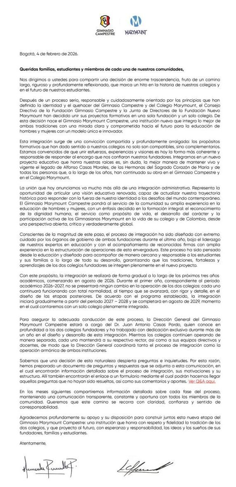

> *Originally posted on [LinkedIn](https://www.linkedin.com/posts/smuriel_noticia-que-no-he-visto-por-ac%C3%A1-pero-gigante-activity-7425210164334522369-Ho1i)*

Noticia que no he visto por acá pero gigante en educación K12 - se fusionaron el Colegio Marymount y el Gimnasio Campestre 🤯

Efecto clarísimo de las dinámicas culturales y sociales de los últimos 20 años.

Para los que no son de Bogotá - estos fueron mucho tiempo 2 de los pesos pesados en educación de la ciudad. Ambos 80 años de funcionamiento, mucho tiempo en el top de listas de calidad, referentes del sector.

Una fusión de estas no es cualquier cosa - para hacerse una idea, cada estudiante es un negocio de ~60 millones de pesos al año y de mil millones de pesos totales en su paso por el colegio. Cada colegio de estos (~2000 estudiantes de base instalada) tiene entonces, vivo y andando, una "base" de negocio de cientos de miles de millones de pesos.

Esta fusión es un M&A de organizaciones GRANDES.

El problema - esa base se ha visto disminuida radicalmente en las últimas dos décadas.

Motivos:

1️⃣  Hay menos niños. La natalidad ha caído de más de 2 hijos por mujer a menos de un hijo por mujer en esos 20 años.
2️⃣ La cultura se ha alejado de los colegios masculinos o femeninos y de los colegios religiosos, iendo ahora por preferencia a colegios mixtos y laicos.

Combinado - colegios donde antes entraban 3-4 salones de 30 a 40 estudiantes al año (~100 a 200 estudiantes en primer grado), ahora entraban 15 a 20. 15 a 20!! Disminución del 80 a 90% en admisiones.

No solo pasó en estos - otros han reaccionado. El Moderno se volvió calendario B y mixto. El Cervantes mixto.

Otros han traído nuevo liderazgo e ideas para renovarse. Nuevas cabezas e ideas 💡  El Buckingham de la mano de [Juliana Salazar Borda](https://www.linkedin.com/in/juliana-salazar-borda) con el programa HEI. [Juan Sebastián Hoyos Montes](https://www.linkedin.com/in/juan-sebastián-hoyos-montes-22653b2b) en el Moderno. [Luis Eduardo Rivas Garzón](https://www.linkedin.com/in/luis-eduardo-rivas-garzón-5ab69057) en el Richmond. [Rafael Castro](https://www.linkedin.com/in/rafael-castro-99678b124) en Los Cerros. [Camilo Bonilla Perez](https://www.linkedin.com/in/camilo-bonilla-perez-43583310) en el Tilatá.

Otros más cerraron. El Sans Facon famosamente. Y 60 colegios al año en Bogotá cierran por estos motivos.

Lección - el que no se adapta, muere. Hay que traer nuevas ideas, modelos y frameworks a la educación (en todos los niveles) - pero sobre todo en K12.

Mucha suerte en el proceso y felicitaciones por dar el paso al Marymount y al Campestre - y a [Juan  Antonio Casas](https://www.linkedin.com/in/juan-antonio-casas-1857b5100) por el camino que se viene y por tomar una decisión tan acertada.

¿Uds que piensan del cambio? ¿Cómo más creen que se puede cambiar para darle frente a las nuevas realidades? ¿Qué otras instituciones están adaptándose, o cuales no están reaccionando y deberían hacerlo?

