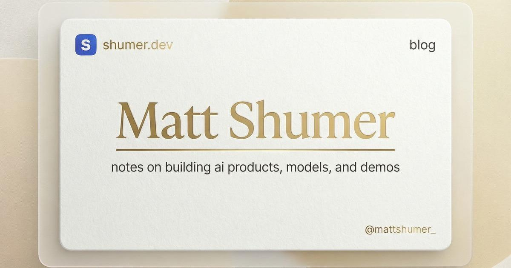

> *Originally posted on [LinkedIn](https://www.linkedin.com/posts/smuriel_something-big-is-happening-activity-7427700315409387521-hpWX)*

Algo grande está pasando se queda corto. Algo cataclismico.

[https://lnkd.in/eBJZze-W](https://lnkd.in/eBJZze-W)

Esta semana estuve programando con el nuevo modelo de Anthropic - Claude 4.6

Honestamente, creo que ya nunca jamás tendré que echar código a mano. No exagero - 1-shotteo cosas con calidad igual (o me atrevo a decir mejor) que lo que haría yo a mano en semanas.

Otro nivel.

Que va a pasar con las demás profesiones? Se les viene el cambio pronto.

Que locura. No se qué futuro venga para todos (y para mis hijos en particular...) pero va a ser muy diferente al presente.

