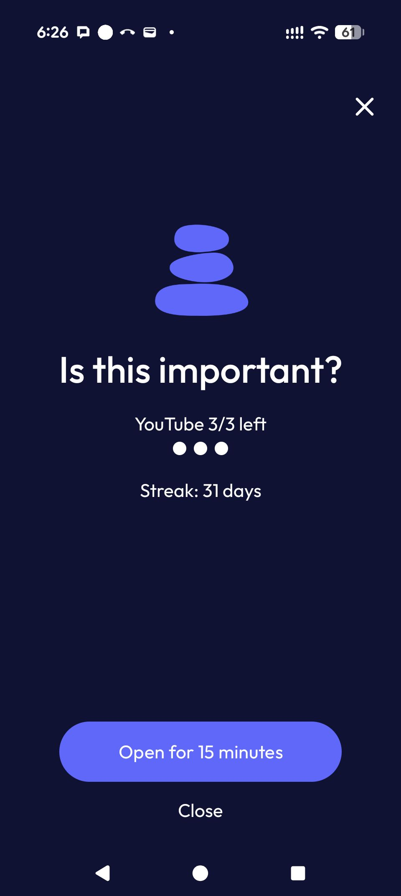

> *Originally posted on [LinkedIn](https://www.linkedin.com/posts/smuriel_un-mes-de-controlar-mi-adicci%C3%B3n-a-shorts-activity-7428437112749727744-6SkU)*

Un mes de controlar mi adicción a shorts y videos de YouTube.

De 2 horas al día a 35 mins.

La app se llama ScreenZen si a alguien le puede funcionar. Me da X número de sesiones al día de Y minutos cada una - 3 sesiones de 15 mins cada una en mi caso.

¿Tienen otras tecnicas o apps que funcionen?

