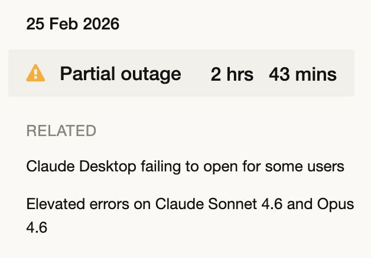

> *Originally posted on [LinkedIn](https://www.linkedin.com/posts/smuriel_todo-el-mundo-habla-de-bancolombia-pero-activity-7432503008321777665-fsUm)*

Todo el mundo habla de Bancolombia - pero Claude Code lleva caído 3 horas y me ha dado mil veces más duro 🫠 ahora soy un inútil sin AI para programar!

El lado malo de la AI - todos nos volvemos dependientes de los proveedores. Me bajare un modelo open-source bueno. ¿Cuál recomiendan?

