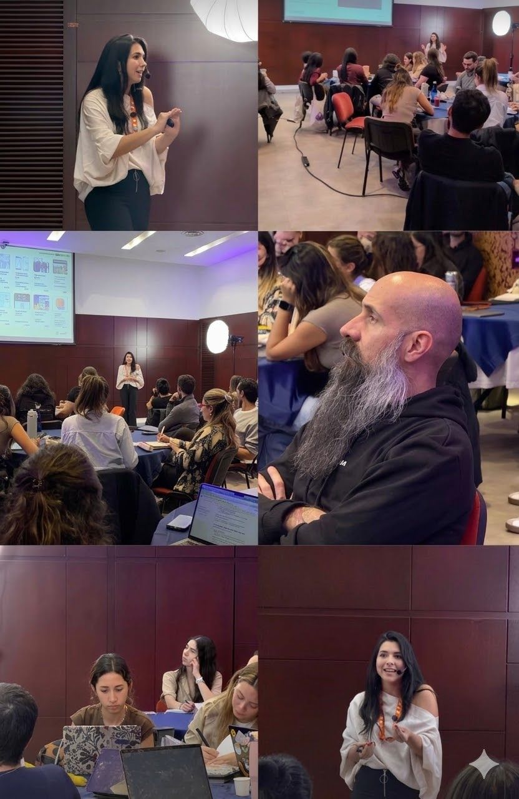

> *Originally posted on [LinkedIn](https://www.linkedin.com/posts/smuriel_enamorarse-del-problema-y-no-de-la-soluci%C3%B3n-activity-7435454413374238720-YJJI)*

😍 Enamorarse del problema y no de la solución.

Muy rápido saltamos a una "solución ideal" - sin haber entendido de verdad el problema.

¿Cual es el problema raíz? ¿A quién le duele o importa? No será solo al usuario sino a todo un ecosistema. ¿Quién compone ese ecosistema?

En educación superior, tienen una perspectiva del problema los estudiantes, los padres, los profesores, los administradores de colegios, los emprendedores edtech, los reguladores de ministerios y secretarías, los empleadores, los financiadores... Y la lista sigue.

¿Cuántos nos quedamos con hablar con 10 usuarios y ya pasar a solucionar? Hay que ir mucho más a fondo - mejor hablar con 10 distintos tipos de actores que con 10 personas del mismo.

Ayer tuvimos nuestra sesión de Pensamiento Sistémico y Pensamiento de Diseño del Action Lab con [Natalia Rodríguez Triana](https://linkedin.com/in/nat-innovacion). Una masterclass en entender tu problema - y enamorarte de el.

Uds - ¿cómo investigan su problema? ¿lo siguen haciendo ya después de lanzado? ¿cómo usan tecnología para ayudar el proceso?

