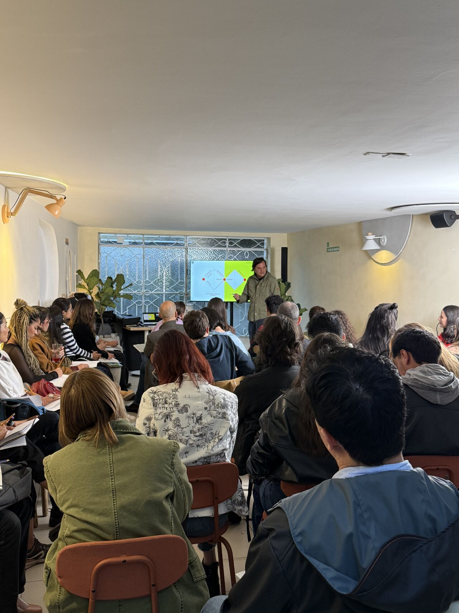
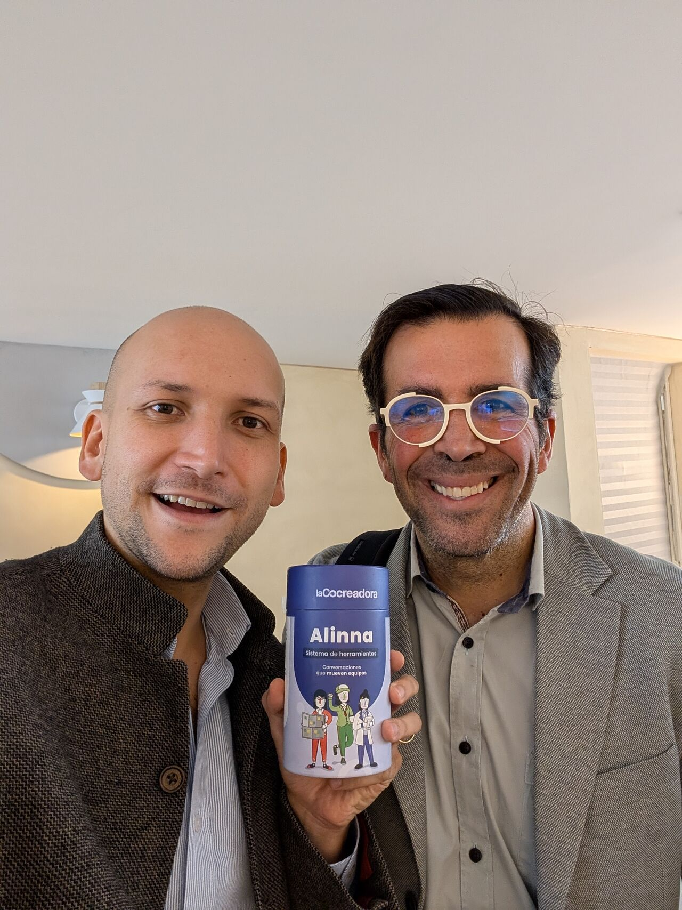
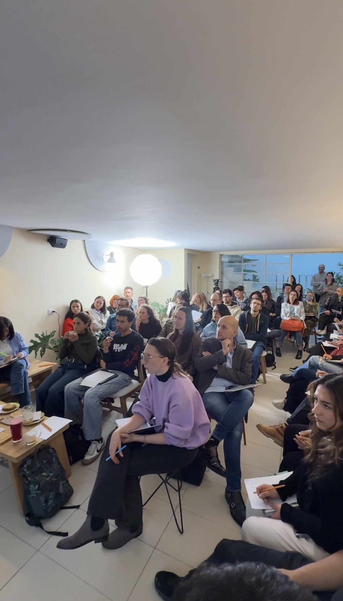
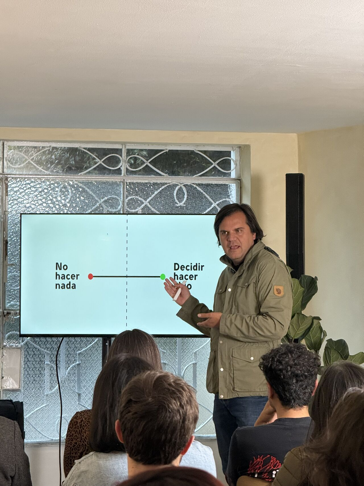
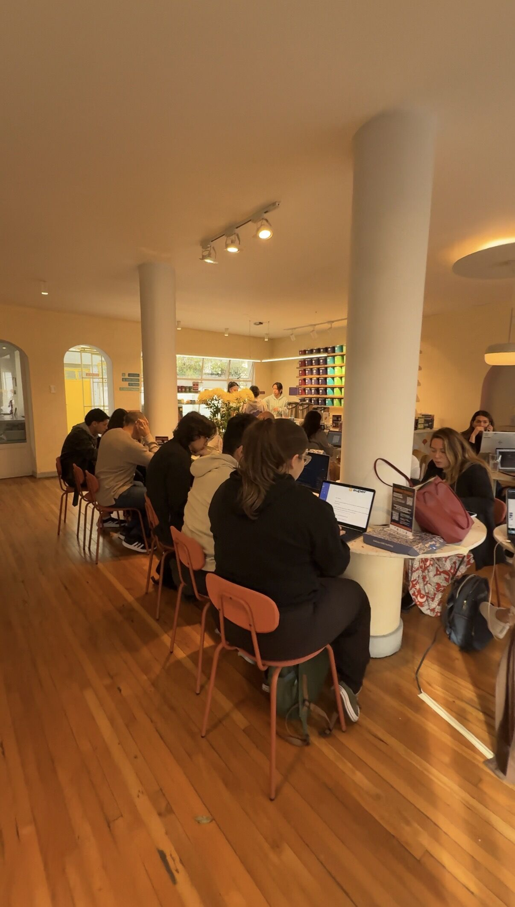

> *Originally posted on [LinkedIn](https://www.linkedin.com/posts/smuriel_conectar-y-conversar-parte-b%C3%A1sica-de-crecer-activity-7438231056358506496-5ytk)*

Conectar y conversar - parte BÁSICA de crecer profesionalmente pero que a veces se nos olvida, se va entre las grietas.

Mi solución - reservarle tiempo. Cada Jueves, pase lo que pase, conozco gente nueva, interesante, vibrante 🤩

Ayer tuve conversaciones profundas con una mamá que junta familias con colegios ([María Alejandra F.](https://linkedin.com/in/mariaalejandrafrancobernal)), un emprendedor en energía ([Ricardo Forero Gómez](https://linkedin.com/in/ricardoforerogómez-comercial)), una apasionada por las comunidades en datos ([Maria Alejandra Restrepo, CDMP](https://linkedin.com/in/mariarestrepot),), un innovador y consultor en cultura organizacional ([Roberto Bolullo Caramés](https://linkedin.com/in/robertobolullo), pd thx por regalarme Alinna!!), una estructuradora empresarial ([Diana Hincapie](https://linkedin.com/in/diana-hincapie-a455b4170)), combo de soñadores en tech y producto ([David Lancheros](https://linkedin.com/in/david-lancheros) y [Natalia Castro Montaña](https://linkedin.com/in/natalia-castro-montana)).

Combo - al final charla de creatividad con el crack [Santiago Amador](https://linkedin.com/in/santiago-amador-91b1733b) 🔥

Cada semana nuevas personas, nuevas ideas. De ese material, nuevas conexiones neuronales. Más creatividad. Más crecimiento.

Y un día, en la ducha, una idea nueva 💡. Inmediata, inesperada - pero imposible sin ese estímulo semanal.

Sahil Bloom le llama tiempo de "Consumo". Reservarse tiempo para consumir podcasts, libros, charlas... yo le agrego, reservar tiempo para conversar con personas nuevas, interesantes.

8 horas a la semana de aprender de nuevos temas, conversar de ideas alejadas de mi mundo típico. De nutrir mi perspectiva de la de otros.

Se los recomiendo - ya sea en nuestros jueves de coworking, en su casa par de horas a la semana, en un club de lectura. Cómo sea, sacarle tiempo a conectar, conversar, aprender.

Les juro, luego salen más ideas en la ducha, en los sueños, en el camino al trabajo.

¿Ustedes, cómo le sacan tiempo a ver nuevas perspectivas y aprender? ¿Algún evento, podcast, ritual recomendado?

PD: Dejo fotico de mi slide favorito del taller de Santi. Entre No hacer nada y Decidir hacer algo solo hay una línea imaginaria... y un salto diminuto.

